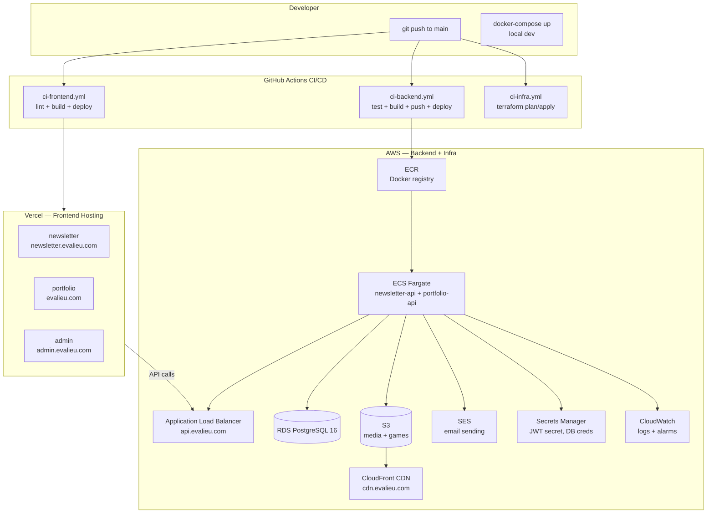
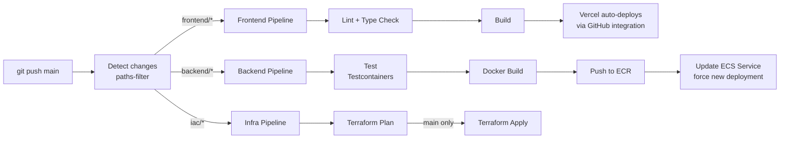

# Phase 0 — Infrastructure, CI/CD & Deployment

**Status:** `[x]` Complete
**Repo areas:** `iac/`, `.github/workflows/`, `backend/*/Dockerfile`, `docker-compose.yml`

## Goal

Set up the full infrastructure, CI/CD pipelines, and deployment tooling so that every future phase can be deployed with a single `git push` to `main`. Local dev runs via Docker Compose. Production runs on AWS.

---

## Architecture



---

## Technical Choices

| Concern | Choice | Rationale |
|---------|--------|-----------|
| Frontend hosting | **Vercel** (free tier) | Zero-config Next.js deployment; automatic preview deploys per PR; edge CDN; free for personal projects |
| Backend hosting | **AWS ECS Fargate** | Serverless containers — no EC2 management; scales to zero-ish; per-second billing; Docker-native |
| Container registry | **AWS ECR** | Same account as ECS; no cross-account auth needed |
| Load balancer | **AWS ALB** | Path-based routing: `/api/newsletter/*` → newsletter-api, `/api/portfolio/*` → portfolio-api; TLS termination |
| Database | **AWS RDS PostgreSQL 16** | Managed backups, Multi-AZ optional, 1-click scaling; `db.t4g.micro` for personal use (~$15/mo) |
| Object storage | **AWS S3** + **CloudFront** | Private bucket, CloudFront for CDN delivery; presigned URLs for upload |
| Email | **AWS SES** | Already in plan; same AWS account |
| Secrets | **AWS Secrets Manager** | JWT secret, DB password, SES credentials — injected into ECS task definitions as env vars |
| DNS | **AWS Route 53** or external registrar | `evalieu.com` → Vercel (A/CNAME), `api.evalieu.com` → ALB, `cdn.evalieu.com` → CloudFront |
| IaC | **Terraform** (OpenTofu compatible) | Declarative, statefile tracks drift, modules for reusable patterns; stored in `iac/` |
| CI/CD | **GitHub Actions** | Already in repo; path-filtered workflows; free for public repos |
| Local dev | **Docker Compose** | PostgreSQL + both APIs in one `docker-compose up`; frontends run via `npm run dev` |
| Monitoring | **CloudWatch Logs + Alarms** | Centralized logging from ECS; alarm on 5xx spike → SNS → email |

---

## Tasks

### 1. Docker — Backend Containerization

- [ ] **`backend/newsletter-api/Dockerfile`**:

```dockerfile
FROM eclipse-temurin:21-jdk AS build
WORKDIR /app
COPY . .
RUN ./gradlew bootJar -x test

FROM eclipse-temurin:21-jre
WORKDIR /app
COPY --from=build /app/build/libs/*.jar app.jar
EXPOSE 8081
ENTRYPOINT ["java", "-jar", "app.jar"]
```

- [ ] **`backend/portfolio-api/Dockerfile`** — same pattern, expose 8080

- [ ] **`.dockerignore`** in each backend dir:

```
.gradle/
build/
*.md
.git/
```

---

### 2. Docker Compose — Local Dev

- [ ] **`docker-compose.yml`** at repo root:

```yaml
services:
  postgres:
    image: postgres:16
    ports: ["5432:5432"]
    environment:
      POSTGRES_DB: evalieu_dev
      POSTGRES_USER: evalieu
      POSTGRES_PASSWORD: evalieu
    volumes:
      - pgdata:/var/lib/postgresql/data

  newsletter-api:
    build: ./backend/newsletter-api
    ports: ["8081:8081"]
    environment:
      SPRING_PROFILES_ACTIVE: dev
      DATABASE_URL: jdbc:postgresql://postgres:5432/evalieu_dev
      DATABASE_USER: evalieu
      DATABASE_PASSWORD: evalieu
      JWT_SECRET: dev-secret-change-in-prod
      AWS_S3_BUCKET: evalieu-dev-media
      AWS_REGION: us-east-1
    depends_on: [postgres]

  portfolio-api:
    build: ./backend/portfolio-api
    ports: ["8080:8080"]
    environment:
      SPRING_PROFILES_ACTIVE: dev
      DATABASE_URL: jdbc:postgresql://postgres:5432/evalieu_dev
      DATABASE_USER: evalieu
      DATABASE_PASSWORD: evalieu
      JWT_SECRET: dev-secret-change-in-prod
    depends_on: [postgres]

volumes:
  pgdata:
```

- [ ] **Developer workflow**:
  - `docker-compose up -d` — starts PostgreSQL + both APIs
  - `npm run dev` — starts all 3 frontends (portfolio :3000, newsletter :3001, admin :3002)
  - Or `docker-compose up -d postgres` + run APIs via `./gradlew bootRun` for hot reload

---

### 3. Terraform — `iac/`

```
iac/
├── main.tf                 provider, backend (S3 + DynamoDB state lock)
├── variables.tf            environment, region, domain, DB instance size
├── outputs.tf              ALB DNS, ECR URLs, RDS endpoint, CloudFront domain
├── environments/
│   ├── dev.tfvars
│   └── prod.tfvars
├── modules/
│   ├── networking/         VPC, subnets, security groups, NAT gateway
│   │   ├── main.tf
│   │   ├── variables.tf
│   │   └── outputs.tf
│   ├── ecs/                ECS cluster, task defs, services, ALB
│   │   ├── main.tf         2 services: newsletter-api, portfolio-api
│   │   ├── variables.tf
│   │   └── outputs.tf
│   ├── rds/                RDS PostgreSQL instance
│   │   ├── main.tf
│   │   ├── variables.tf
│   │   └── outputs.tf
│   ├── s3/                 S3 bucket + CloudFront distribution
│   │   ├── main.tf
│   │   ├── variables.tf
│   │   └── outputs.tf
│   ├── ses/                SES domain verification, SNS topic for webhooks
│   │   ├── main.tf
│   │   └── variables.tf
│   └── secrets/            Secrets Manager entries
│       ├── main.tf
│       └── variables.tf
```

- [ ] **State backend** — S3 bucket + DynamoDB table for state locking:

```hcl
terraform {
  backend "s3" {
    bucket         = "evalieu-terraform-state"
    key            = "prod/terraform.tfstate"
    region         = "us-east-1"
    dynamodb_table = "evalieu-terraform-locks"
    encrypt        = true
  }
}
```

- [ ] **Networking module**:
  - VPC with 2 public + 2 private subnets across 2 AZs
  - NAT Gateway (single, cost-saving) for private subnet egress
  - Security groups: ALB (80/443 inbound), ECS tasks (8080/8081 from ALB only), RDS (5432 from ECS only)

- [ ] **ECS module**:
  - Fargate cluster
  - Task definitions: 0.25 vCPU / 512MB RAM per API (personal site scale)
  - Services: desired count 1, auto-scaling 1-3 based on CPU (target 70%)
  - ALB with path-based routing:
    - `/api/newsletter/*` → newsletter-api target group (port 8081)
    - `/api/portfolio/*` → portfolio-api target group (port 8080)
    - `/api/health` → both (health checks)
  - TLS certificate via ACM on `api.evalieu.com`

- [ ] **RDS module**:
  - `db.t4g.micro` (2 vCPU, 1GB RAM) — sufficient for personal site
  - PostgreSQL 16, 20GB gp3 storage, automated backups (7 days retention)
  - Not Multi-AZ (cost saving; single-AZ is fine for personal site)
  - Security group: only accessible from ECS task security group

- [ ] **S3 + CloudFront module**:
  - Private S3 bucket `evalieu-media-prod`
  - CloudFront distribution on `cdn.evalieu.com` with OAC (Origin Access Control)
  - Second CloudFront distribution for games on `games.evalieu.com`
  - Cache policy: images cached 30 days, videos cached 7 days

- [ ] **SES module**:
  - Domain identity verification for `evalieu.com`
  - DKIM DNS records output for manual DNS entry (or Route 53 auto)
  - SNS topic for bounce/complaint notifications → HTTPS subscription to API webhook

- [ ] **Secrets Manager module**:
  - `evalieu/jwt-secret`
  - `evalieu/db-password`
  - Referenced in ECS task definitions via `secrets` block

---

### 4. CI/CD Pipelines — `.github/workflows/`

**Deployment flow:**



- [ ] **`.github/workflows/ci-frontend.yml`** — updated:

```yaml
name: CI — Frontend

on:
  push:
    branches: [main, dev]
    paths: ['frontend/**', 'package.json', 'turbo.json']
  pull_request:
    branches: [main, dev]
    paths: ['frontend/**']

jobs:
  lint-and-build:
    runs-on: ubuntu-latest
    steps:
      - uses: actions/checkout@v4
      - uses: actions/setup-node@v4
        with:
          node-version: '22'
          cache: 'npm'
      - run: npm ci
      - run: npx turbo lint build

  # Vercel handles deployment automatically via GitHub integration
  # No manual deploy step needed — Vercel watches main branch
```

- [ ] **`.github/workflows/ci-backend.yml`** — updated with deployment:

```yaml
name: CI — Backend

on:
  push:
    branches: [main, dev]
    paths: ['backend/**']
  pull_request:
    branches: [main, dev]
    paths: ['backend/**']

jobs:
  detect_changes:
    runs-on: ubuntu-latest
    outputs:
      newsletter_api: ${{ steps.filter.outputs.newsletter_api }}
      portfolio_api: ${{ steps.filter.outputs.portfolio_api }}
    steps:
      - uses: actions/checkout@v4
      - uses: dorny/paths-filter@v3
        id: filter
        with:
          filters: |
            newsletter_api:
              - 'backend/newsletter-api/**'
            portfolio_api:
              - 'backend/portfolio-api/**'

  test:
    needs: detect_changes
    if: needs.detect_changes.outputs.newsletter_api == 'true' || needs.detect_changes.outputs.portfolio_api == 'true'
    runs-on: ubuntu-latest
    steps:
      - uses: actions/checkout@v4
      - uses: actions/setup-java@v4
        with:
          java-version: '21'
          distribution: 'temurin'
          cache: 'gradle'
      - name: Test newsletter-api
        if: needs.detect_changes.outputs.newsletter_api == 'true'
        run: cd backend/newsletter-api && ./gradlew test
      - name: Test portfolio-api
        if: needs.detect_changes.outputs.portfolio_api == 'true'
        run: cd backend/portfolio-api && ./gradlew test

  deploy:
    needs: [detect_changes, test]
    if: github.ref == 'refs/heads/main'
    runs-on: ubuntu-latest
    permissions:
      id-token: write
      contents: read
    steps:
      - uses: actions/checkout@v4
      - uses: aws-actions/configure-aws-credentials@v4
        with:
          role-to-assume: ${{ secrets.AWS_DEPLOY_ROLE_ARN }}
          aws-region: us-east-1
      - uses: aws-actions/amazon-ecr-login@v2
        id: ecr

      - name: Build and push newsletter-api
        if: needs.detect_changes.outputs.newsletter_api == 'true'
        run: |
          docker build -t ${{ steps.ecr.outputs.registry }}/evalieu-newsletter-api:${{ github.sha }} backend/newsletter-api
          docker push ${{ steps.ecr.outputs.registry }}/evalieu-newsletter-api:${{ github.sha }}
          aws ecs update-service --cluster evalieu --service newsletter-api --force-new-deployment

      - name: Build and push portfolio-api
        if: needs.detect_changes.outputs.portfolio_api == 'true'
        run: |
          docker build -t ${{ steps.ecr.outputs.registry }}/evalieu-portfolio-api:${{ github.sha }} backend/portfolio-api
          docker push ${{ steps.ecr.outputs.registry }}/evalieu-portfolio-api:${{ github.sha }}
          aws ecs update-service --cluster evalieu --service portfolio-api --force-new-deployment
```

- [ ] **`.github/workflows/ci-infra.yml`** — new:

```yaml
name: CI — Infrastructure

on:
  push:
    branches: [main]
    paths: ['iac/**']
  pull_request:
    branches: [main]
    paths: ['iac/**']

jobs:
  plan:
    runs-on: ubuntu-latest
    permissions:
      id-token: write
      contents: read
      pull-requests: write
    steps:
      - uses: actions/checkout@v4
      - uses: hashicorp/setup-terraform@v3
      - uses: aws-actions/configure-aws-credentials@v4
        with:
          role-to-assume: ${{ secrets.AWS_DEPLOY_ROLE_ARN }}
          aws-region: us-east-1
      - run: terraform init
        working-directory: iac
      - run: terraform plan -var-file=environments/prod.tfvars -out=tfplan
        working-directory: iac
      - name: Post plan to PR
        if: github.event_name == 'pull_request'
        uses: borchero/terraform-plan-comment@v2
        with:
          working-directory: iac

  apply:
    needs: plan
    if: github.ref == 'refs/heads/main' && github.event_name == 'push'
    runs-on: ubuntu-latest
    permissions:
      id-token: write
      contents: read
    environment: production
    steps:
      - uses: actions/checkout@v4
      - uses: hashicorp/setup-terraform@v3
      - uses: aws-actions/configure-aws-credentials@v4
        with:
          role-to-assume: ${{ secrets.AWS_DEPLOY_ROLE_ARN }}
          aws-region: us-east-1
      - run: terraform init && terraform apply -var-file=environments/prod.tfvars -auto-approve
        working-directory: iac
```

---

### 5. Vercel Setup

- [ ] Connect GitHub repo to Vercel
- [ ] Create 3 Vercel projects linked to the same repo:
  - **evalieu-portfolio**: root directory = `frontend/portfolio`, production domain = `evalieu.com`
  - **evalieu-newsletter**: root directory = `frontend/newsletter`, production domain = `newsletter.evalieu.com`
  - **evalieu-admin**: root directory = `frontend/admin`, production domain = `admin.evalieu.com`
- [ ] Each project auto-deploys on push to `main` (filtered by root directory)
- [ ] Preview deploys on PRs (automatic)
- [ ] Environment variables set in Vercel dashboard:
  - `NEXT_PUBLIC_API_URL` = `https://api.evalieu.com`
  - `NEXT_PUBLIC_GA_ID` (Phase 8)
  - `NEXT_PUBLIC_ADSENSE_CLIENT` (Phase 8)

---

### 6. AWS Account Setup (manual, one-time)

- [ ] Create AWS account (or use existing)
- [ ] Create IAM OIDC provider for GitHub Actions (no static keys — uses `role-to-assume`)
- [ ] Create deploy IAM role with policies: ECR push, ECS update, S3 read/write, Secrets Manager read, Terraform state S3/DynamoDB
- [ ] Create Terraform state S3 bucket + DynamoDB locks table
- [ ] Create ECR repositories: `evalieu-newsletter-api`, `evalieu-portfolio-api`
- [ ] Register domain `evalieu.com` (or configure existing DNS)
- [ ] Request ACM certificate for `*.evalieu.com` and `evalieu.com`

---

### 7. Domain & DNS Layout

| Domain | Points To | Purpose |
|--------|-----------|---------|
| `evalieu.com` | Vercel (portfolio) | Public portfolio site |
| `newsletter.evalieu.com` | Vercel (newsletter) | Public newsletter site |
| `admin.evalieu.com` | Vercel (admin) | Admin PWA (not linked publicly) |
| `api.evalieu.com` | ALB | Backend APIs |
| `cdn.evalieu.com` | CloudFront | Media assets (images, video) |
| `games.evalieu.com` | CloudFront | Embedded game files |

---

### 8. Monitoring & Alerting

- [ ] **CloudWatch Log Groups**: `/ecs/newsletter-api`, `/ecs/portfolio-api` — ECS task stdout/stderr
- [ ] **CloudWatch Alarms**:
  - 5xx error rate > 5% on ALB → SNS → email
  - ECS task count = 0 (service down) → SNS → email
  - RDS CPU > 80% sustained → SNS → email
  - RDS free storage < 2GB → SNS → email
  - SES bounce rate > 5% → SNS → email
- [ ] **SNS Topic** `evalieu-alerts` → email subscription to admin email
- [ ] **CloudWatch Dashboard** (optional): ALB request count, latency p50/p99, ECS CPU/memory, RDS connections

---

### 9. Cost Estimate (Personal Site Scale)

| Service | Config | Est. Monthly Cost |
|---------|--------|-------------------|
| Vercel | Free tier (3 projects, hobby plan) | $0 |
| ECS Fargate | 2 tasks × 0.25 vCPU × 512MB | ~$10 |
| RDS PostgreSQL | db.t4g.micro, 20GB, single-AZ | ~$15 |
| ECR | < 1GB images | ~$0.10 |
| ALB | 1 ALB, low traffic | ~$16 |
| S3 | < 10GB storage | ~$0.25 |
| CloudFront | Low traffic | ~$1 |
| SES | < 1000 emails/mo | ~$0.10 |
| Route 53 | 1 hosted zone | $0.50 |
| Secrets Manager | 5 secrets | ~$2 |
| **Total** | | **~$45/mo** |

---

## Deployment Cheat Sheet

```bash
# First-time infra setup
cd iac && terraform init && terraform apply -var-file=environments/prod.tfvars

# Deploy everything manually (normally CI/CD handles this)
# Frontend: push to main → Vercel auto-deploys
# Backend:
docker build -t newsletter-api backend/newsletter-api
docker tag newsletter-api:latest <ecr-url>/evalieu-newsletter-api:latest
docker push <ecr-url>/evalieu-newsletter-api:latest
aws ecs update-service --cluster evalieu --service newsletter-api --force-new-deployment

# Local dev
docker-compose up -d         # PostgreSQL + APIs
npm run dev                  # All 3 frontends

# Run only backend (with hot reload)
docker-compose up -d postgres
cd backend/newsletter-api && ./gradlew bootRun
cd backend/portfolio-api && ./gradlew bootRun
```

---

## Decisions & Notes

| Decision | Choice | Why |
|----------|--------|-----|
| Vercel over Amplify for frontends | Vercel | Zero-config Next.js deployment, free tier includes 3 projects, preview deploys, edge CDN, better DX than Amplify for Next.js |
| ECS Fargate over EC2/EB | Fargate | No server management, per-second billing, Docker-native, scales to near-zero for personal site |
| GitHub OIDC over static AWS keys | OIDC | No long-lived credentials in GitHub secrets; role assumption is more secure and best practice |
| Terraform over CDK/Pulumi | Terraform | Most widely used IaC; large community; declarative; HCL is simpler than CDK's imperative code for this scale |
| Single ALB with path routing | ALB | Cheaper than 2 ALBs; both APIs share `api.evalieu.com` with path-based routing |
| Single-AZ RDS | Single-AZ | Multi-AZ doubles cost (~$30/mo); for a personal site, acceptable risk of minutes of downtime during AZ failure |

<!-- Record additional decisions during implementation here -->
