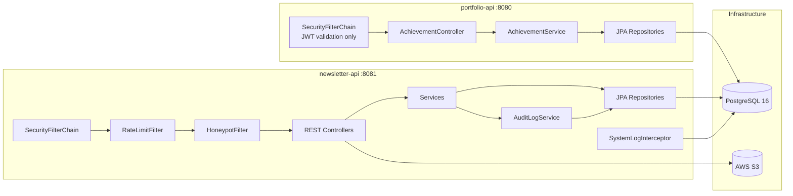

# Phase 1 — Content API Foundation

**Status:** `[x]` Complete
**Repo areas:** `backend/newsletter-api/`, `backend/portfolio-api/`

## Goal

Stand up the full PostgreSQL schema and Spring Boot REST API that all future phases depend on. No frontend work in this phase.

---

## Architecture



---

## Technical Choices

| Concern | Choice | Rationale |
|---------|--------|-----------|
| Database | PostgreSQL 16 via Docker (dev), RDS (prod) | JSON column support for `reaction_counts`, `gallery_urls`, `tags`; Flyway handles migrations |
| ORM | Spring Data JPA + Hibernate 7.1 | Standard for Spring Boot 4; `@Entity` mapping with Lombok `@Data`/`@Builder` |
| Auth | Spring Security 7.x + `jjwt` 0.13.0 (io.jsonwebtoken) | HMAC-SHA256 signing; `httpOnly`/`Secure`/`SameSite=Strict` cookies |
| Rate limiting | Bucket4j + Caffeine cache (in-memory) | No Redis needed at this scale; per-IP token bucket |
| S3 | AWS SDK v2 (`software.amazon.awssdk:s3`) | Presigned PUT URLs for direct frontend upload |
| Logging | Logback + `logstash-logback-encoder` | JSON structured logs; custom appender writes WARN/ERROR to `system_logs` table |
| Spring Boot | **4.0.6** (Spring Framework 7, Jakarta EE 11, Jackson 3, Servlet 6.1) | Latest LTS; Boot 3.x EOL June 2026; virtual threads, built-in API versioning |
| Profiles | `application.properties` (base), `application-dev.properties` (H2), `application-prod.properties` (RDS) | H2 in-memory for local dev; PostgreSQL for test/prod |
| Testing | JUnit 5 + Mockito (unit), Testcontainers + PostgreSQL (integration) | Portfolio-api currently uses TestNG; newsletter-api standardizes on JUnit 5 |

---

## Tasks

### 1. Dev Infrastructure Setup

- [ ] Add `docker-compose.yml` at repo root:

```yaml
# PostgreSQL 16, port 5432
# credentials: evalieu/evalieu, db: evalieu_dev
# PgAdmin optional on port 5050
```

- [ ] `backend/newsletter-api/src/main/resources/application-dev.properties`:

```properties
spring.datasource.url=jdbc:postgresql://localhost:5432/evalieu_dev
spring.datasource.username=evalieu
spring.datasource.password=evalieu
spring.jpa.hibernate.ddl-auto=validate
spring.flyway.enabled=true
```

- [ ] `backend/newsletter-api/src/main/resources/application-prod.properties`:

```properties
spring.datasource.url=${DATABASE_URL}
spring.datasource.username=${DATABASE_USER}
spring.datasource.password=${DATABASE_PASSWORD}
spring.flyway.enabled=true
```

- [ ] Update `backend/newsletter-api/build.gradle`:
  - Add: `implementation 'org.postgresql:postgresql'`
  - Add: `implementation 'io.jsonwebtoken:jjwt-api:0.13.0'`
  - Add: `runtimeOnly 'io.jsonwebtoken:jjwt-impl:0.13.0'`
  - Add: `runtimeOnly 'io.jsonwebtoken:jjwt-jackson:0.13.0'`
  - Add: `implementation 'software.amazon.awssdk:s3:2.29.51'`
  - Add: `implementation 'com.bucket4j:bucket4j-core:8.10.1'`
  - Add: `implementation 'com.github.ben-manes.caffeine:caffeine:3.1.8'`
  - Add: `implementation 'net.logstash.logback:logstash-logback-encoder:8.0'`
  - Keep: Flyway, Spring Web, Spring Data JPA, Validation, Lombok, DevTools

---

### 2. Database Schema — Flyway Migrations

All files in `backend/newsletter-api/src/main/resources/db/migration/`.

- [ ] **`V1__create_issues.sql`** — Issues first (posts reference issue_id)

```sql
CREATE TABLE issues (
    id              BIGSERIAL PRIMARY KEY,
    month           SMALLINT NOT NULL,
    year            SMALLINT NOT NULL,
    title           VARCHAR(255) NOT NULL,
    layout_preference VARCHAR(20) NOT NULL DEFAULT 'newspaper',  -- newspaper | magazine
    status          VARCHAR(20) NOT NULL DEFAULT 'draft',        -- draft | published
    cover_image_url TEXT,
    created_at      TIMESTAMP NOT NULL DEFAULT NOW(),
    updated_at      TIMESTAMP NOT NULL DEFAULT NOW(),
    UNIQUE(month, year)
);
```

- [ ] **`V2__create_categories.sql`**

```sql
CREATE TABLE categories (
    id          BIGSERIAL PRIMARY KEY,
    name        VARCHAR(100) NOT NULL UNIQUE,
    slug        VARCHAR(100) NOT NULL UNIQUE,
    sort_order  INT NOT NULL DEFAULT 0
);

CREATE TABLE subcategories (
    id          BIGSERIAL PRIMARY KEY,
    category_id BIGINT NOT NULL REFERENCES categories(id),
    name        VARCHAR(100) NOT NULL,
    slug        VARCHAR(100) NOT NULL,
    UNIQUE(category_id, slug)
);

-- Seed data
INSERT INTO categories (name, slug, sort_order) VALUES
('Writing', 'writing', 1), ('Projects', 'projects', 2),
('Reviews', 'reviews', 3), ('Life', 'life', 4),
('Tracking', 'tracking', 5), ('Games', 'games', 6);
```

- [ ] **`V3__create_posts.sql`**

```sql
CREATE TABLE posts (
    id              BIGSERIAL PRIMARY KEY,
    title           VARCHAR(500) NOT NULL,
    slug            VARCHAR(500) NOT NULL UNIQUE,
    excerpt         TEXT,
    body            TEXT NOT NULL,
    category_id     BIGINT REFERENCES categories(id),
    subcategory_id  BIGINT REFERENCES subcategories(id),
    cover_image_url TEXT,
    gallery_urls    JSONB DEFAULT '[]'::jsonb,   -- ["https://cdn.../img1.jpg", ...]
    video_url       TEXT,                        -- S3/CloudFront hosted video OR external embed URL
    video_type      VARCHAR(20),                 -- hosted | youtube | vimeo
    status          VARCHAR(20) NOT NULL DEFAULT 'draft',    -- draft | published | archived
    format          VARCHAR(30) NOT NULL DEFAULT 'article',  -- article | photo-caption | embedded-game | project-link | list | recipe | tracking-entry | quote
    layout_hint     VARCHAR(20) NOT NULL DEFAULT 'column',   -- featured | column | brief | sidebar | pull-quote
    issue_id        BIGINT REFERENCES issues(id),
    tags            JSONB DEFAULT '[]'::jsonb,
    published_at    TIMESTAMP,
    comment_count   INT NOT NULL DEFAULT 0,
    reaction_counts JSONB DEFAULT '{}'::jsonb,               -- {"❤️": 12, "🔥": 5, ...}
    quote_author    VARCHAR(255),
    quote_source    VARCHAR(500),
    game_url        TEXT,
    game_type       VARCHAR(10),   -- iframe | canvas | link
    view_count      INT NOT NULL DEFAULT 0,
    created_at      TIMESTAMP NOT NULL DEFAULT NOW(),
    updated_at      TIMESTAMP NOT NULL DEFAULT NOW()
);

CREATE INDEX idx_posts_status ON posts(status);
CREATE INDEX idx_posts_issue ON posts(issue_id);
CREATE INDEX idx_posts_category ON posts(category_id);
CREATE INDEX idx_posts_published ON posts(published_at DESC);
CREATE INDEX idx_posts_slug ON posts(slug);
```

- [ ] **`V4__create_comments.sql`**

```sql
CREATE TABLE comments (
    id              BIGSERIAL PRIMARY KEY,
    post_id         BIGINT NOT NULL REFERENCES posts(id) ON DELETE CASCADE,
    author_name     VARCHAR(100) NOT NULL,
    author_email    VARCHAR(255) NOT NULL,  -- never exposed publicly
    body            TEXT NOT NULL,
    status          VARCHAR(20) NOT NULL DEFAULT 'pending',  -- pending | approved | rejected
    created_at      TIMESTAMP NOT NULL DEFAULT NOW()
);

CREATE INDEX idx_comments_post ON comments(post_id);
CREATE INDEX idx_comments_status ON comments(status);
```

- [ ] **`V5__create_reactions.sql`**

```sql
CREATE TABLE reactions (
    id          BIGSERIAL PRIMARY KEY,
    post_id     BIGINT NOT NULL REFERENCES posts(id) ON DELETE CASCADE,
    emoji       VARCHAR(10) NOT NULL,
    session_id  VARCHAR(64) NOT NULL,  -- hashed browser fingerprint
    created_at  TIMESTAMP NOT NULL DEFAULT NOW(),
    UNIQUE(post_id, session_id)
);

CREATE INDEX idx_reactions_post ON reactions(post_id);
```

- [ ] **`V6__create_subscribers.sql`**

```sql
CREATE TABLE subscribers (
    id                  BIGSERIAL PRIMARY KEY,
    email               VARCHAR(255) NOT NULL UNIQUE,
    display_name        VARCHAR(100),
    status              VARCHAR(20) NOT NULL DEFAULT 'pending',  -- pending | confirmed | unsubscribed
    source              VARCHAR(255),
    confirmation_token  VARCHAR(64),
    token_expires_at    TIMESTAMP,
    confirmed_at        TIMESTAMP,
    unsubscribed_at     TIMESTAMP,
    created_at          TIMESTAMP NOT NULL DEFAULT NOW()
);

CREATE INDEX idx_subscribers_status ON subscribers(status);
CREATE INDEX idx_subscribers_token ON subscribers(confirmation_token);
```

- [ ] **`V7__create_hobbies.sql`**

```sql
CREATE TABLE hobbies (
    id          BIGSERIAL PRIMARY KEY,
    name        VARCHAR(255) NOT NULL,
    category    VARCHAR(100),
    started_at  DATE,
    created_at  TIMESTAMP NOT NULL DEFAULT NOW()
);

CREATE TABLE hobby_progress_entries (
    id          BIGSERIAL PRIMARY KEY,
    hobby_id    BIGINT NOT NULL REFERENCES hobbies(id) ON DELETE CASCADE,
    entry_date  DATE NOT NULL,
    note        TEXT,
    milestone   BOOLEAN NOT NULL DEFAULT FALSE,
    photo_url   TEXT,
    created_at  TIMESTAMP NOT NULL DEFAULT NOW()
);

CREATE INDEX idx_hobby_entries_hobby ON hobby_progress_entries(hobby_id);
```

- [ ] **`V8__create_recipes.sql`**

```sql
CREATE TABLE recipes (
    id          BIGSERIAL PRIMARY KEY,
    post_id     BIGINT REFERENCES posts(id) ON DELETE SET NULL,  -- optional link to a post
    name        VARCHAR(255) NOT NULL,
    slug        VARCHAR(255) NOT NULL UNIQUE,
    ingredients JSONB NOT NULL DEFAULT '[]'::jsonb,   -- ["2 cups flour", ...]
    steps       JSONB NOT NULL DEFAULT '[]'::jsonb,   -- ["Preheat oven...", ...]
    cook_time   VARCHAR(50),
    rating      SMALLINT,  -- 1-5
    photo_url   TEXT,
    date_made   DATE,
    created_at  TIMESTAMP NOT NULL DEFAULT NOW(),
    updated_at  TIMESTAMP NOT NULL DEFAULT NOW()
);
```

- [ ] **`V9__create_admin_audit_log.sql`**

```sql
CREATE TABLE admin_audit_log (
    id              BIGSERIAL PRIMARY KEY,
    action          VARCHAR(50) NOT NULL,   -- POST_CREATED, POST_PUBLISHED, COMMENT_APPROVED, ISSUE_SENT, etc.
    entity_type     VARCHAR(50) NOT NULL,   -- post, issue, comment, subscriber, etc.
    entity_id       BIGINT,
    detail          JSONB,                  -- {"old_status": "draft", "new_status": "published"}
    performed_at    TIMESTAMP NOT NULL DEFAULT NOW()
);

CREATE INDEX idx_audit_action ON admin_audit_log(action);
CREATE INDEX idx_audit_time ON admin_audit_log(performed_at DESC);
```

- [ ] **`V10__create_system_logs.sql`**

```sql
CREATE TABLE system_logs (
    id          BIGSERIAL PRIMARY KEY,
    severity    VARCHAR(10) NOT NULL,   -- ERROR | WARN | INFO
    service     VARCHAR(50) NOT NULL,   -- newsletter-api | portfolio-api
    message     TEXT NOT NULL,
    stack_trace TEXT,
    endpoint    VARCHAR(255),
    logged_at   TIMESTAMP NOT NULL DEFAULT NOW()
);

CREATE INDEX idx_syslogs_severity ON system_logs(severity);
CREATE INDEX idx_syslogs_time ON system_logs(logged_at DESC);
```

- [ ] **`V11__create_admin_user.sql`**

```sql
CREATE TABLE admin_users (
    id              BIGSERIAL PRIMARY KEY,
    email           VARCHAR(255) NOT NULL UNIQUE,
    password_hash   VARCHAR(255) NOT NULL,  -- BCrypt
    created_at      TIMESTAMP NOT NULL DEFAULT NOW()
);
```

- [ ] **`V12__create_site_settings.sql`**

```sql
CREATE TABLE site_settings (
    key     VARCHAR(100) PRIMARY KEY,
    value   TEXT NOT NULL
);

INSERT INTO site_settings (key, value) VALUES
('site_name', 'Eva''s Newsletter'),
('publication_name', 'The Eva Times'),
('ko_fi_url', ''),
('default_layout', 'newspaper'),
('admin_email', ''),
('error_alert_threshold', '10');
```

- [ ] **`V13__create_recommendations.sql`**

```sql
CREATE TABLE recommendations (
    id          BIGSERIAL PRIMARY KEY,
    type        VARCHAR(20) NOT NULL,  -- book | show | movie | other
    title       VARCHAR(255) NOT NULL,
    note        TEXT,
    submitted_by VARCHAR(100),
    status      VARCHAR(20) NOT NULL DEFAULT 'pending',  -- pending | reviewed
    created_at  TIMESTAMP NOT NULL DEFAULT NOW()
);
```

---

### 3. Java Package Structure — newsletter-api

```
backend/newsletter-api/src/main/java/com/evalieu_api/newsletter/
├── NewsletterApplication.java
├── config/
│   ├── SecurityConfig.java           SecurityFilterChain, CORS, CSRF disabled, stateless session
│   ├── S3Config.java                 S3Client bean, bucket name from env
│   ├── RateLimitConfig.java          Bucket4j beans, Caffeine cache for per-IP buckets
│   └── JacksonConfig.java            ObjectMapper with JavaTimeModule, JSONB support
├── security/
│   ├── JwtService.java               generate, validate, parse claims; HMAC-SHA256; 1hr access + 7d refresh
│   ├── JwtAuthenticationFilter.java  OncePerRequestFilter; reads JWT from httpOnly cookie; sets SecurityContext
│   └── LoginRequest.java             DTO: email, password
├── filter/
│   ├── RateLimitFilter.java          OncePerRequestFilter; checks Bucket4j per-IP per-endpoint
│   └── HoneypotFilter.java          OncePerRequestFilter; rejects requests with non-empty honeypot param
├── model/
│   ├── Post.java                     @Entity, @Table("posts"), JSONB mapped via @JdbcTypeCode(SqlTypes.JSON)
│   ├── Issue.java                    @Entity
│   ├── Category.java                 @Entity
│   ├── Subcategory.java              @Entity, @ManyToOne Category
│   ├── Comment.java                  @Entity
│   ├── Reaction.java                 @Entity, unique constraint (post_id, session_id)
│   ├── Subscriber.java              @Entity
│   ├── Hobby.java                    @Entity, @OneToMany HobbyProgressEntry
│   ├── HobbyProgressEntry.java      @Entity
│   ├── Recipe.java                   @Entity, optional @ManyToOne Post
│   ├── AdminAuditLog.java           @Entity, immutable
│   ├── SystemLog.java               @Entity
│   ├── AdminUser.java               @Entity
│   ├── SiteSetting.java             @Entity, @Id key
│   └── Recommendation.java          @Entity
├── repository/
│   ├── PostRepository.java           extends JpaRepository<Post, Long>; custom: findBySlug, findByIssueId, findByCategoryId
│   ├── IssueRepository.java
│   ├── CategoryRepository.java
│   ├── CommentRepository.java        custom: findByPostIdAndStatus, countByStatus
│   ├── ReactionRepository.java       custom: findByPostIdAndSessionId, countByPostIdGroupByEmoji
│   ├── SubscriberRepository.java     custom: findByEmail, findByConfirmationToken, countByStatus
│   ├── HobbyRepository.java
│   ├── RecipeRepository.java
│   ├── AuditLogRepository.java
│   ├── SystemLogRepository.java
│   ├── AdminUserRepository.java
│   ├── SiteSettingRepository.java
│   └── RecommendationRepository.java
├── service/
│   ├── PostService.java              CRUD; slug generation (Slugify lib); denormalized count updates
│   ├── IssueService.java             CRUD; enforce unique month+year
│   ├── CommentService.java           submit (sanitize HTML, validate, set pending), approve, reject, delete; update post.comment_count
│   ├── ReactionService.java          react (upsert), unreact; recalculate post.reaction_counts
│   ├── SubscriberService.java        subscribe, confirm, unsubscribe; token generation (UUID v4)
│   ├── HobbyService.java             CRUD hobbies + progress entries
│   ├── RecipeService.java            CRUD
│   ├── AuditLogService.java          record(action, entityType, entityId, detail) — called by every admin method
│   ├── S3Service.java                generatePresignedUrl(filename, contentType) → returns presigned PUT URL + final object URL
│   ├── AuthService.java              login (BCrypt verify), issue JWT pair, refresh, logout (cookie clear)
│   └── SiteSettingService.java       get, update; cached in Caffeine
├── controller/
│   ├── PostController.java           GET /api/posts, GET /api/posts/{slug}, POST/PUT/DELETE /api/admin/posts
│   ├── IssueController.java          GET /api/issues, GET /api/issues/{slug}, POST/PUT/DELETE /api/admin/issues
│   ├── CategoryController.java       GET /api/categories
│   ├── CommentController.java        POST /api/posts/{id}/comments (public); GET/PATCH/DELETE /api/admin/comments
│   ├── ReactionController.java       POST/DELETE /api/posts/{id}/reactions (public)
│   ├── SubscriberController.java     POST /api/subscribe, GET /api/subscribe/confirm, GET /api/unsubscribe; GET/DELETE /api/admin/subscribers
│   ├── HobbyController.java         POST/PUT/DELETE /api/admin/hobbies; GET /api/hobbies (public read)
│   ├── RecipeController.java         POST/PUT/DELETE /api/admin/recipes; GET /api/recipes (public read)
│   ├── MediaController.java          POST /api/admin/media/presign
│   ├── AuthController.java           POST /api/auth/login, POST /api/auth/refresh, POST /api/auth/logout
│   ├── AuditLogController.java       GET /api/admin/audit-log (paginated, filterable)
│   ├── SystemLogController.java      GET /api/admin/system-logs (paginated, filterable)
│   ├── HealthController.java         GET /api/health — returns {db: "ok", s3: "ok", ses: "ok"}
│   ├── SiteSettingController.java    GET/PUT /api/admin/settings
│   └── RecommendationController.java POST /api/recommendations (public); GET /api/admin/recommendations
├── dto/
│   ├── PostRequest.java              incoming create/update DTO (validated with @NotBlank, @Size, etc.)
│   ├── PostResponse.java             outgoing DTO (excludes internal fields)
│   ├── CommentRequest.java           displayName, email, body, honeypot
│   ├── CommentResponse.java          excludes author_email
│   ├── ReactionRequest.java          emoji, sessionId
│   ├── SubscribeRequest.java         email, honeypot
│   ├── IssueRequest.java
│   ├── IssueResponse.java
│   ├── PresignResponse.java          uploadUrl, objectUrl
│   ├── HealthResponse.java           db, s3, ses statuses
│   └── PagedResponse.java            generic wrapper: content[], totalElements, totalPages, page, size
├── exception/
│   ├── ResourceNotFoundException.java
│   ├── RateLimitExceededException.java
│   ├── DuplicateResourceException.java
│   └── GlobalExceptionHandler.java   @RestControllerAdvice; maps exceptions to HTTP status + JSON body
└── logging/
    └── DbLogAppender.java            Logback appender; writes WARN/ERROR to system_logs table via JDBC (async, non-blocking)
```

---

### 4. API Contracts Summary

**Public endpoints (no auth required)**

| Method | Path | Description |
|--------|------|-------------|
| GET | `/api/posts?page=0&size=20&category=&status=published` | List published posts (paginated) |
| GET | `/api/posts/{slug}` | Single post by slug |
| GET | `/api/issues?page=0&size=12` | List published issues |
| GET | `/api/issues/{slug}` | Single issue + its posts |
| GET | `/api/categories` | All categories with subcategories |
| GET | `/api/hobbies` | All hobbies with latest entries |
| GET | `/api/hobbies/{id}` | Single hobby with all entries |
| GET | `/api/recipes?page=0&size=20` | List recipes |
| GET | `/api/recipes/{slug}` | Single recipe |
| GET | `/api/posts/{id}/comments?page=0&size=50` | Approved comments for a post |
| POST | `/api/posts/{id}/comments` | Submit comment (goes to pending) |
| POST | `/api/posts/{id}/reactions` | Add/change emoji reaction |
| DELETE | `/api/posts/{id}/reactions` | Remove reaction |
| POST | `/api/subscribe` | Subscribe to newsletter |
| GET | `/api/subscribe/confirm?token=` | Confirm subscription |
| GET | `/api/unsubscribe?token=` | Unsubscribe |
| POST | `/api/recommendations` | Submit a recommendation |
| GET | `/api/health` | Service health check |

**Admin endpoints (JWT required)**

| Method | Path | Description |
|--------|------|-------------|
| POST | `/api/auth/login` | Login, returns JWT in httpOnly cookie |
| POST | `/api/auth/refresh` | Refresh access token |
| POST | `/api/auth/logout` | Clear JWT cookie |
| POST/PUT/DELETE | `/api/admin/posts` | Post CRUD |
| POST/PUT/DELETE | `/api/admin/issues` | Issue CRUD |
| GET/PATCH/DELETE | `/api/admin/comments` | Comment moderation |
| GET/DELETE | `/api/admin/subscribers` | Subscriber management |
| POST/PUT/DELETE | `/api/admin/hobbies` | Hobby CRUD |
| POST/PUT/DELETE | `/api/admin/recipes` | Recipe CRUD |
| POST | `/api/admin/media/presign` | Get S3 presigned upload URL |
| GET | `/api/admin/audit-log` | Audit log (paginated) |
| GET | `/api/admin/system-logs` | System logs (paginated) |
| GET/PUT | `/api/admin/settings` | Site settings |
| GET | `/api/admin/recommendations` | View submitted recommendations |

---

### 5. Security Implementation

**`config/SecurityConfig.java`**

```java
@Bean
public SecurityFilterChain filterChain(HttpSecurity http) {
    http
        .csrf(csrf -> csrf.disable())                    // API-only, no forms
        .sessionManagement(s -> s.sessionCreationPolicy(STATELESS))
        .cors(cors -> cors.configurationSource(corsSource()))
        .addFilterBefore(jwtAuthFilter, UsernamePasswordAuthenticationFilter.class)
        .addFilterBefore(rateLimitFilter, JwtAuthenticationFilter.class)
        .authorizeHttpRequests(auth -> auth
            .requestMatchers("/api/auth/**").permitAll()
            .requestMatchers("/api/health").permitAll()
            .requestMatchers(HttpMethod.GET, "/api/posts/**", "/api/issues/**",
                "/api/categories/**", "/api/hobbies/**", "/api/recipes/**").permitAll()
            .requestMatchers(HttpMethod.POST, "/api/posts/*/comments",
                "/api/posts/*/reactions", "/api/subscribe",
                "/api/recommendations").permitAll()
            .requestMatchers(HttpMethod.DELETE, "/api/posts/*/reactions").permitAll()
            .requestMatchers("/api/subscribe/**", "/api/unsubscribe").permitAll()
            .requestMatchers("/api/admin/**").authenticated()
            .anyRequest().denyAll()
        );
    return http.build();
}
```

**JWT cookie config in `JwtService.java`:**

```java
ResponseCookie.from("access_token", token)
    .httpOnly(true)
    .secure(true)           // HTTPS only
    .sameSite("Strict")
    .path("/")
    .maxAge(Duration.ofHours(1))
    .build();
```

**Rate limit config (Bucket4j):**
- Login: 5 tokens / 15 minutes / IP
- Comment submit: 3 tokens / 1 hour / IP
- Subscribe: 3 tokens / 1 hour / IP
- Reactions: 20 tokens / 1 hour / IP
- General API: 100 tokens / 1 minute / IP

---

### 6. S3 Presigned URL Flow

```mermaid
sequenceDiagram
    participant Admin as Admin Frontend
    participant API as newsletter-api
    participant S3 as AWS S3

    Admin->>API: POST /api/admin/media/presign {filename, contentType}
    API->>API: Validate contentType (images: jpeg/png/webp/gif; video: mp4/webm/quicktime)
    API->>API: Generate unique key: media/{yyyy}/{mm}/{uuid}-{filename}
    API->>S3: Generate presigned PUT URL (5 min expiry; 10MB max images, 500MB max video)
    API-->>Admin: {uploadUrl, objectUrl}
    Admin->>S3: PUT file directly to uploadUrl
    Admin->>API: Include objectUrl in post/achievement create/update
```

---

### 7. portfolio-api Changes

**`backend/portfolio-api/build.gradle`** — add:
- `implementation 'io.jsonwebtoken:jjwt-api:0.13.0'`
- `runtimeOnly 'io.jsonwebtoken:jjwt-impl:0.13.0'`, `jjwt-jackson:0.13.0`

**Shared JWT secret**: Both APIs read `JWT_SECRET` from the same environment variable. `newsletter-api` issues tokens; `portfolio-api` only validates them.

**New files in portfolio-api:**

```
backend/portfolio-api/src/main/java/com/evalieu_api/portfolio/
├── security/
│   ├── JwtValidationFilter.java     reads JWT from cookie; validates with shared secret; sets SecurityContext
│   └── SecurityConfig.java          protects /api/admin/** endpoints
├── controller/
│   └── AchievementAdminController.java
│       POST   /api/admin/projects/{id}/achievements  — create
│       PUT    /api/admin/achievements/{id}            — update
│       DELETE /api/admin/achievements/{id}            — delete
└── dto/
    └── AchievementRequest.java      title, date, context, photoUrl (validated)
```

---

### 8. Logging & Monitoring

**`backend/newsletter-api/src/main/resources/logback-spring.xml`:**

```xml
<configuration>
    <appender name="CONSOLE" class="ch.qos.logback.core.ConsoleAppender">
        <encoder class="net.logstash.logback.encoder.LogstashEncoder"/>
    </appender>

    <appender name="DB" class="com.evalieu_api.newsletter.logging.DbLogAppender">
        <filter class="ch.qos.logback.classic.filter.ThresholdFilter">
            <level>WARN</level>
        </filter>
    </appender>

    <root level="INFO">
        <appender-ref ref="CONSOLE"/>
        <appender-ref ref="DB"/>
    </root>
</configuration>
```

**`DbLogAppender`**: extends `AppenderBase<ILoggingEvent>`, uses async queue + `JdbcTemplate` to write to `system_logs`. Caps at 10,000 rows (deletes oldest on insert if over limit).

---

### 9. Testing Strategy

**Unit tests** (`src/test/java/.../service/`)
- [ ] `PostServiceTest` — CRUD, slug generation, status transitions, reaction count recalculation
- [ ] `CommentServiceTest` — submit sanitization, approve/reject flow, count update
- [ ] `ReactionServiceTest` — upsert, uniqueness enforcement, count aggregation
- [ ] `AuthServiceTest` — login success/failure, BCrypt, token generation
- [ ] `SubscriberServiceTest` — subscribe, confirm, unsubscribe, token expiry
- [ ] `AuditLogServiceTest` — record action, verify persistence

**Integration tests** (`src/test/java/.../controller/`)
- [ ] `PostControllerIT` — Testcontainers PostgreSQL; full request/response cycle
- [ ] `AuthControllerIT` — login, receive cookie, access protected endpoint, refresh
- [ ] `CommentControllerIT` — submit, verify pending, approve via admin, verify public read
- [ ] `RateLimitIT` — exceed limit, verify 429 response
- [ ] `HoneypotIT` — submit with honeypot field, verify silent rejection

**Test config**: `application-test.properties` uses Testcontainers JDBC URL (`jdbc:tc:postgresql:16:///test`)

---

## Decisions & Notes

| Decision | Choice | Why |
|----------|--------|-----|
| Spring Boot 3.x → 4.0.6 | Spring Boot 4 | Boot 3.x reaches EOL June 2026; Boot 4 ships with Spring Framework 7, Jakarta EE 11, Hibernate 7.1, Jackson 3, and built-in virtual threads support |
| jjwt 0.12 → 0.13.0 | jjwt 0.13.0 | Fixes known CVEs in 0.12.x; adds `Jwts.builder().header()` fluent API; aligns with Jackson 3 serialization in Boot 4 |
| H2 for dev, Testcontainers for tests, RDS for prod | Layered DB strategy | H2 is fast for hot-reload dev cycles; Testcontainers gives real PostgreSQL for integration tests; RDS for production durability |
| Bucket4j in-memory over Redis | Bucket4j + Caffeine | Personal site doesn't need distributed rate limiting; eliminates Redis operational cost and complexity |

<!-- Record additional decisions during implementation here -->
