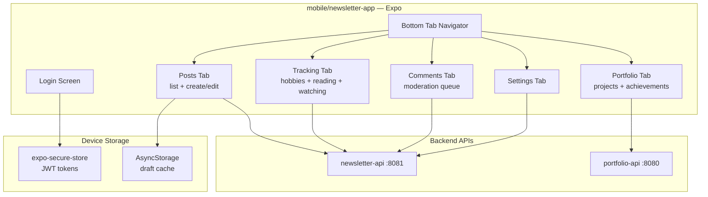

# Phase 10 — React Native Mobile App

**Status:** `[ ]` Not started
**Repo areas:** `mobile/newsletter-app/` (new)
**Depends on:** Phase 4

## Goal

Native iOS and Android admin app for writing posts, logging portfolio achievements, moderating comments, and tracking hobbies — all from your phone. Built with Expo, sharing types from `@evalieu/common`.

---

## Architecture



## Technical Choices

| Concern | Choice | Rationale |
|---------|--------|-----------|
| Framework | Expo SDK 55 (managed workflow) | No native module linking; OTA updates; EAS Build/Submit; React Native 0.79+ with New Architecture default |
| Navigation | Expo Router (file-based) | Consistent with Next.js mental model; deep linking support |
| Auth storage | `expo-secure-store` for tokens | Encrypted keychain (iOS) / keystore (Android) |
| Draft persistence | `AsyncStorage` | Offline draft saving; syncs on next launch |
| API client | Shared `api.ts` module (similar to web admin) | Same endpoints; token attached from SecureStore |
| Image picker | `expo-image-picker` | Camera + gallery; returns URI for S3 upload |
| Push notifications | Expo Push Notifications + backend webhook | Notify on new pending comments |
| Markdown editing | `react-native-markdown-editor` or plain `TextInput` with preview | Mobile Markdown editing is inherently limited; keep it simple |
| UI components | React Native Paper (Material Design 3) | Polished, accessible, dark mode support, good mobile UX |
| State management | Zustand (lightweight) + React Query (server state) | Zustand for auth/settings; React Query for API cache + mutations |

---

## Tasks

### 1. Project Setup

- [ ] Create project:

```bash
npx create-expo-app mobile/newsletter-app --template expo-template-blank-typescript
```

- [ ] **`mobile/newsletter-app/package.json`**:

```json
{
  "name": "@evalieu/mobile",
  "dependencies": {
    "@evalieu/common": "*",
    "expo": "~55.0.0",
    "expo-router": "~5.0.0",
    "expo-secure-store": "~15.0.0",
    "expo-image-picker": "~17.0.0",
    "expo-notifications": "~0.32.0",
    "react-native-paper": "^5",
    "@tanstack/react-query": "^5",
    "zustand": "^5"
  }
}
```

- [ ] Configure `app.json`:

```json
{
  "expo": {
    "name": "Eva's Admin",
    "slug": "evalieu-admin",
    "scheme": "evalieu",
    "ios": { "bundleIdentifier": "com.evalieu.admin" },
    "android": { "package": "com.evalieu.admin" },
    "plugins": ["expo-router", "expo-secure-store", "expo-image-picker"]
  }
}
```

- [ ] Add `mobile/newsletter-app` to root `package.json` workspaces:

```json
"workspaces": ["frontend/*", "mobile/*"]
```

---

### 2. Auth — `mobile/newsletter-app/src/lib/`

- [ ] **`auth.ts`**:

```typescript
import * as SecureStore from 'expo-secure-store';

const API_BASE = Constants.expoConfig?.extra?.apiUrl || 'http://localhost:8081';

export async function login(email: string, password: string): Promise<boolean> {
  const res = await fetch(`${API_BASE}/api/auth/login`, {
    method: 'POST',
    headers: { 'Content-Type': 'application/json' },
    body: JSON.stringify({ email, password }),
  });
  if (!res.ok) return false;

  const { accessToken, refreshToken } = await res.json();
  await SecureStore.setItemAsync('accessToken', accessToken);
  await SecureStore.setItemAsync('refreshToken', refreshToken);
  return true;
}

export async function getToken(): Promise<string | null> {
  return SecureStore.getItemAsync('accessToken');
}

export async function refresh(): Promise<boolean> {
  const refreshToken = await SecureStore.getItemAsync('refreshToken');
  if (!refreshToken) return false;

  const res = await fetch(`${API_BASE}/api/auth/refresh`, {
    method: 'POST',
    headers: { 'Authorization': `Bearer ${refreshToken}` },
  });
  if (!res.ok) return false;

  const { accessToken } = await res.json();
  await SecureStore.setItemAsync('accessToken', accessToken);
  return true;
}

export async function logout() {
  await SecureStore.deleteItemAsync('accessToken');
  await SecureStore.deleteItemAsync('refreshToken');
}
```

- [ ] **`api.ts`** — authenticated fetch:

```typescript
export async function adminFetch<T>(path: string, options?: RequestInit): Promise<T> {
  let token = await getToken();

  let res = await fetch(`${API_BASE}${path}`, {
    ...options,
    headers: { 'Authorization': `Bearer ${token}`, 'Content-Type': 'application/json', ...options?.headers },
  });

  // Auto-refresh on 401
  if (res.status === 401) {
    const refreshed = await refresh();
    if (!refreshed) throw new Error('Session expired');
    token = await getToken();
    res = await fetch(`${API_BASE}${path}`, {
      ...options,
      headers: { 'Authorization': `Bearer ${token}`, 'Content-Type': 'application/json', ...options?.headers },
    });
  }

  if (!res.ok) throw new Error(`API ${res.status}`);
  return res.json();
}
```

Note: Mobile auth uses `Authorization: Bearer` header instead of cookies (cookies don't work well in React Native).

- [ ] **Backend change**: `JwtAuthenticationFilter` in both APIs must also check `Authorization` header (in addition to cookie) to support mobile.

---

### 3. Navigation — File-Based Routes

```
mobile/newsletter-app/app/
├── _layout.tsx          Root layout (auth check, React Query provider)
├── login.tsx            Login screen
├── (tabs)/
│   ├── _layout.tsx      Bottom tab navigator
│   ├── posts/
│   │   ├── index.tsx    Post list
│   │   ├── new.tsx      Create post
│   │   └── [id].tsx     Edit post
│   ├── portfolio/
│   │   ├── index.tsx    Project list
│   │   ├── [id]/
│   │   │   ├── index.tsx       Project detail + achievement timeline
│   │   │   └── achievement.tsx Log new achievement
│   │   └── new.tsx      Create project
│   ├── tracking/
│   │   ├── index.tsx    Tabs: Hobbies | Reading | Watching
│   │   ├── hobby/[id].tsx    Hobby detail + add entry
│   │   └── recipe/[id].tsx   Recipe detail
│   ├── comments/
│   │   └── index.tsx    Moderation queue
│   └── settings/
│       └── index.tsx    Settings + health + logout
```

- [ ] **Bottom tabs**: Posts (FileText), Portfolio (Briefcase), Tracking (Target), Comments (MessageSquare) with badge, Settings (Settings)

---

### 4. Posts Screen

- [ ] **Post list** (`app/(tabs)/posts/index.tsx`):
  - React Query: `useQuery(['posts'], () => adminFetch('/api/admin/posts'))`
  - FlatList with pull-to-refresh
  - Filter chips: All | Published | Drafts
  - Search bar (client-side filter)
  - FAB (floating action button) → "New Post"

- [ ] **Create/Edit post** (`app/(tabs)/posts/new.tsx`, `app/(tabs)/posts/[id].tsx`):
  - ScrollView form: title, excerpt, category picker (bottom sheet), format picker, layout hint picker
  - Markdown text input (multi-line `TextInput` with monospace font)
  - Preview toggle — renders Markdown in a WebView
  - Cover image: "Take Photo" / "Choose from Library" via `expo-image-picker` → upload to S3 → store URL
  - Video: "Record Video" / "Choose Video" via `expo-image-picker` (mediaTypes: 'Videos') → upload to S3 (max 500MB) → sets `videoType: 'hosted'`; or paste YouTube/Vimeo URL input → auto-detect type
  - Issue assignment dropdown
  - Tags input
  - Save Draft / Publish buttons in header

- [ ] **Draft auto-save**: every 30 seconds, save current form state to AsyncStorage; on app reopen, offer to restore draft

---

### 5. Portfolio Screen

- [ ] **Project list** — FlatList, each row: title, achievement count, featured badge
- [ ] **Project detail** — project info card + scrollable achievement timeline below
- [ ] **"Log Achievement"** — quick form screen:

```typescript
// app/(tabs)/portfolio/[id]/achievement.tsx
function LogAchievement() {
  const { id } = useLocalSearchParams();
  const [title, setTitle] = useState('');
  const [context, setContext] = useState('');
  const [date, setDate] = useState(new Date());
  const [photo, setPhoto] = useState<string | null>(null);

  async function pickImage() {
    const result = await ImagePicker.launchImageLibraryAsync({ quality: 0.8 });
    if (!result.canceled) {
      const uploadedUrl = await uploadToS3(result.assets[0].uri);
      setPhoto(uploadedUrl);
    }
  }

  async function submit() {
    await adminFetch(`/api/admin/projects/${id}/achievements`, {
      method: 'POST',
      body: JSON.stringify({ title, date: date.toISOString(), context, photoUrl: photo }),
    });
    router.back();
  }
  // ... render form
}
```

  - Designed to be done in < 30 seconds: open project → tap "Log" → fill title + note → submit

---

### 6. Comments Moderation Screen

- [ ] FlatList of pending comments: post title, author, body preview, timestamp
- [ ] **Swipe gestures**: swipe right = approve (green), swipe left = reject (red)
  - Use `react-native-gesture-handler` + `Swipeable`
- [ ] Tap to expand full comment body
- [ ] Badge on tab icon: pending count from `useQuery` with `refetchInterval: 60000`

---

### 7. Push Notifications

- [ ] **Expo Push Token** — on login, register push token with backend:

```typescript
const { data: token } = await Notifications.getExpoPushTokenAsync();
await adminFetch('/api/admin/push-token', { method: 'POST', body: JSON.stringify({ token: token.data }) });
```

- [ ] **Backend** — store push tokens in `admin_push_tokens` table:

```sql
CREATE TABLE admin_push_tokens (
    id      BIGSERIAL PRIMARY KEY,
    token   TEXT NOT NULL UNIQUE,
    created_at TIMESTAMP NOT NULL DEFAULT NOW()
);
```

- [ ] **On new pending comment**: backend sends push notification via Expo Push API:

```java
// In CommentService.submit(), after saving pending comment:
pushNotificationService.send("New comment on: " + post.getTitle(), "By " + comment.getAuthorName());
```

---

### 8. Image Upload Helper

- [ ] **`uploadToS3.ts`**:

```typescript
export async function uploadToS3(localUri: string): Promise<string> {
  // Get presigned URL from API
  const { uploadUrl, objectUrl } = await adminFetch('/api/admin/media/presign', {
    method: 'POST',
    body: JSON.stringify({ filename: 'photo.jpg', contentType: 'image/jpeg' }),
  });

  // Read file and upload
  const response = await fetch(localUri);
  const blob = await response.blob();
  await fetch(uploadUrl, { method: 'PUT', headers: { 'Content-Type': 'image/jpeg' }, body: blob });

  return objectUrl;
}
```

---

### 9. App Publishing

- [ ] **EAS Build config** — `eas.json`:

```json
{
  "build": {
    "preview": {
      "distribution": "internal",
      "ios": { "simulator": true }
    },
    "production": {
      "autoIncrement": true
    }
  },
  "submit": {
    "production": {
      "ios": { "appleId": "itsevalieu@gmail.com" },
      "android": { "serviceAccountKeyPath": "./google-service-account.json" }
    }
  }
}
```

- [ ] Build: `eas build --platform all --profile production`
- [ ] Submit iOS: `eas submit --platform ios` → TestFlight → App Store review
- [ ] Submit Android: `eas submit --platform android` → Google Play internal track → production

---

## Decisions & Notes

| Decision | Choice | Why |
|----------|--------|-----|
| Expo SDK 52 → 55 | Expo SDK 55 | SDK 52 EOL by project start; SDK 55 ships React Native 0.79+ with New Architecture enabled by default; better performance, modern JSI bridge |
| Bearer token over cookies | `Authorization: Bearer` header | React Native doesn't handle cookies well; `expo-secure-store` provides encrypted native storage for tokens |
| Zustand + React Query over Redux | Zustand (auth/settings) + React Query (server cache) | Zustand is minimal (< 1KB); React Query handles caching, mutations, refetch logic; no boilerplate |
| React Native Paper over NativeBase | React Native Paper | Material Design 3 native; maintained by Callstack; dark mode built-in; better TypeScript support |
| Plain TextInput for Markdown over rich editor | Multi-line `TextInput` + WebView preview | Mobile rich text editors are fragile; plain text + preview is reliable and predictable |
| Swipe gestures for comment moderation | `react-native-gesture-handler` Swipeable | Natural mobile UX for approve/reject; fast moderation without opening each comment |

<!-- Record additional decisions during implementation here -->
