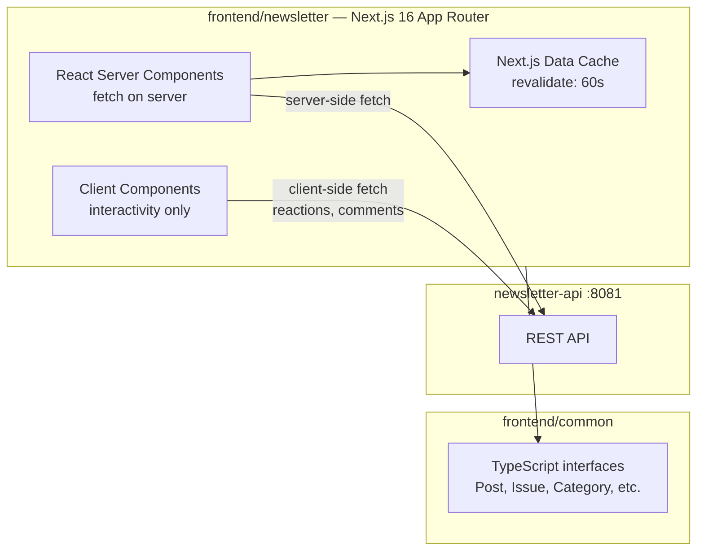

# Phase 2 — Public Site: Newspaper Layout

**Status:** `[x]` Complete
**Repo areas:** `frontend/newsletter/`, `frontend/common/`
**Depends on:** Phase 1

## Goal

Build the public-facing newsletter site with the newspaper front page layout. Readers can browse issues, read articles, and navigate by category. No auth, no admin.

---

## Architecture



## Technical Choices

| Concern | Choice | Rationale |
|---------|--------|-----------|
| Rendering | React Server Components (RSC) via App Router | SEO-critical public site; server-side fetch for posts/issues |
| Data fetching | `fetch()` in server components with `next.revalidate: 60` | ISR-like freshness without full SSR per-request |
| Client interactivity | Client components (`'use client'`) only for reactions, comments, share bar | Minimize JS shipped |
| Markdown rendering | `unified` ecosystem: `remark-parse` → `remark-gfm` → `remark-rehype` → `rehype-sanitize` → `rehype-stringify` | GFM support (tables, task lists), XSS-safe |
| Styling | CSS Modules (`.module.scss`) + Sass | Already used in portfolio; scoped styles, no runtime cost |
| Typography | Google Fonts via `next/font/google`: Playfair Display (headlines), Lora (body), JetBrains Mono (code) | Newspaper aesthetic; self-hosted, no CLS |
| Slug strategy | API returns slug-based URLs; `[slug]` dynamic routes | Human-readable, SEO-friendly |
| Image optimization | `next/image` with remote patterns for S3/CloudFront domain | Automatic srcset, lazy loading, WebP conversion |

---

## Tasks

### 1. Shared Types — `frontend/common/`

File: `frontend/common/src/types/` — add the following alongside existing `Project` and `Achievement`:

- [ ] **`post.ts`**:

```typescript
export interface Post {
  id: number;
  title: string;
  slug: string;
  excerpt: string | null;
  body: string;
  categoryId: number;
  categoryName: string;
  categorySlug: string;
  subcategoryId: number | null;
  subcategoryName: string | null;
  coverImageUrl: string | null;
  galleryUrls: string[];
  videoUrl: string | null;
  videoType: 'hosted' | 'youtube' | 'vimeo' | null;
  status: 'draft' | 'published' | 'archived';
  format: 'article' | 'photo-caption' | 'embedded-game' | 'project-link'
    | 'list' | 'recipe' | 'tracking-entry' | 'quote';
  layoutHint: 'featured' | 'column' | 'brief' | 'sidebar' | 'pull-quote';
  issueId: number | null;
  tags: string[];
  publishedAt: string | null;
  commentCount: number;
  reactionCounts: Record<string, number>;
  quoteAuthor: string | null;
  quoteSource: string | null;
  gameUrl: string | null;
  gameType: 'iframe' | 'canvas' | 'link' | null;
  viewCount: number;
  createdAt: string;
  updatedAt: string;
}
```

- [ ] **`issue.ts`**:

```typescript
export interface Issue {
  id: number;
  month: number;
  year: number;
  title: string;
  slug: string;            // "may-2026"
  layoutPreference: 'newspaper' | 'magazine';
  status: 'draft' | 'published';
  coverImageUrl: string | null;
  posts: Post[];           // populated on issue detail
  createdAt: string;
}
```

- [ ] **`category.ts`**:

```typescript
export interface Category {
  id: number;
  name: string;
  slug: string;
  subcategories: Subcategory[];
}

export interface Subcategory {
  id: number;
  name: string;
  slug: string;
}
```

- [ ] **`comment.ts`** and **`reaction.ts`**:

```typescript
export interface Comment {
  id: number;
  postId: number;
  authorName: string;
  body: string;
  createdAt: string;
}

export interface ReactionSummary {
  emoji: string;
  count: number;
}
```

- [ ] Update `frontend/common/src/index.ts` to export all new types

---

### 2. API Client — `frontend/newsletter/src/lib/`

- [ ] **`api.ts`** — base fetch wrapper:

```typescript
const API_BASE = process.env.NEXT_PUBLIC_API_URL || 'http://localhost:8081';

export async function apiFetch<T>(
  path: string,
  options?: RequestInit & { revalidate?: number }
): Promise<T> {
  const res = await fetch(`${API_BASE}${path}`, {
    ...options,
    next: { revalidate: options?.revalidate ?? 60 },
  });
  if (!res.ok) throw new Error(`API ${res.status}: ${path}`);
  return res.json();
}
```

- [ ] **`posts.ts`** — typed post fetchers:
  - `getPublishedPosts(page, size, category?)` → `PagedResponse<Post>`
  - `getPostBySlug(slug)` → `Post`
  - `getPostsByIssue(issueId)` → `Post[]`
  - `getPostsByCategory(categorySlug, page)` → `PagedResponse<Post>`

- [ ] **`issues.ts`**:
  - `getPublishedIssues()` → `Issue[]`
  - `getLatestIssue()` → `Issue` (with posts populated)
  - `getIssueBySlug(slug)` → `Issue` (with posts)

- [ ] **`categories.ts`**: `getCategories()` → `Category[]`

---

### 3. Pages — `frontend/newsletter/src/app/`

- [ ] **`/` (homepage)** — `page.tsx` (server component):
  - Fetch latest published issue + its posts via `getLatestIssue()`
  - Render `<Masthead>` + `<FrontPageGrid posts={issue.posts} />`
  - Render `<Sidebar>` with briefs, subscribe widget, Ko-fi placeholder
  - Metadata: `generateMetadata()` with OG tags for current issue

- [ ] **`/issues/[slug]/page.tsx`** — specific issue:
  - `generateStaticParams()` → pre-render recent issues at build time
  - Same layout as homepage but for a specific issue
  - `<IssueNav>` with prev/next links

- [ ] **`/posts/[slug]/page.tsx`** — article detail:
  - `generateStaticParams()` for published posts
  - Render `<ArticleHeader>` + `<ArticleBody>` + `<ArticleFooter>`
  - Render `<ReactionBar>` (static counts; interactivity in Phase 6)
  - Render `<CommentCount>` badge
  - Track page view: POST to API on mount (client component wrapper)

- [ ] **`/categories/[category]/page.tsx`** — category listing
- [ ] **`/categories/[category]/[subcategory]/page.tsx`** — subcategory listing

---

### 4. Newspaper Layout Components — `frontend/newsletter/src/components/`

All components in `components/newspaper/`.

- [ ] **`Masthead.tsx`** — server component:
  - Publication name ("The Eva Times") in Playfair Display, large serif
  - Issue date and number
  - Edition tagline (optional)
  - File: `Masthead.tsx` + `Masthead.module.scss`

- [ ] **`FrontPageGrid.tsx`** — server component:
  - CSS Grid layout: `grid-template-columns: 2fr 1fr 1fr` on desktop (3-column)
  - Posts sorted by `layoutHint`: `featured` spans 2 columns row 1; `column` gets 1 column; `brief` is compact; `sidebar` goes to sidebar; `pull-quote` rendered as `<QuoteBlock>`
  - Each post renders as `<ExcerptCard>` or specialized block based on `format`

  CSS Grid structure:
  ```scss
  .grid {
    display: grid;
    grid-template-columns: 2fr 1fr 1fr;
    grid-template-rows: auto;
    gap: 1px;                          // newspaper column rules
    background: var(--color-rule);     // rule color shows through gap
    > * { background: var(--color-bg); padding: var(--spacing-md); }
  }

  @media (max-width: 768px) {
    .grid { grid-template-columns: 1fr; }
  }
  ```

- [ ] **`ExcerptCard.tsx`** — server component:
  - `layout_hint` determines size: `featured` gets `grid-column: span 2; grid-row: span 2`
  - Shows: headline (link), date, first 2 lines of excerpt, category badge
  - Bottom bar: reaction emojis + counts, 💬 comment count
  - Cover image shown for `featured` and `column` hints

- [ ] **`QuoteBlock.tsx`** — for `format: 'quote'` posts:
  - Large decorative quote marks, italic text, attribution line
  - Compact; fits in sidebar or between articles

- [ ] **`PhotoCaptionBlock.tsx`** — for `format: 'photo-caption'`:
  - Full-width image with caption text below, no headline
  - Uses `next/image` with priority loading for above-fold

- [ ] **`SectionDivider.tsx`** — horizontal rule with category label centered
- [ ] **`Sidebar.tsx`** — right column container; holds briefs, ads, Ko-fi, subscribe widget
- [ ] **`IssueNav.tsx`** — previous/next issue links with month/year

---

### 5. Article Page Components — `frontend/newsletter/src/components/article/`

- [ ] **`ArticleHeader.tsx`**:
  - Title (Playfair Display, large), published date, category badge (link), cover image (`next/image`, hero)

- [ ] **`VideoPlayer.tsx`** (`'use client'`) — handles all video types:
  - `hosted` → HTML5 `<video>` with `controls`, `preload="metadata"`, poster from cover image, S3/CloudFront `src`; wrapped in responsive 16:9 container
  - `youtube` → `<iframe src="https://www.youtube-nocookie.com/embed/{videoId}" />` (privacy-enhanced mode), `loading="lazy"`, `allow="fullscreen"`
  - `vimeo` → `<iframe src="https://player.vimeo.com/video/{videoId}" />`, `loading="lazy"`
  - Extracts video ID from full YouTube/Vimeo URLs automatically
  - Placed above the article body when `post.videoUrl` is set
  - Shown on article page; excerpt cards show a play icon overlay on the cover image if video exists

- [ ] **`ArticleBody.tsx`** — server component:
  - Markdown → HTML pipeline:

  ```typescript
  import { unified } from 'unified';
  import remarkParse from 'remark-parse';
  import remarkGfm from 'remark-gfm';
  import remarkRehype from 'remark-rehype';
  import rehypeSanitize from 'rehype-sanitize';
  import rehypeStringify from 'rehype-stringify';

  export async function renderMarkdown(md: string): Promise<string> {
    const result = await unified()
      .use(remarkParse)
      .use(remarkGfm)
      .use(remarkRehype)
      .use(rehypeSanitize)
      .use(rehypeStringify)
      .process(md);
    return String(result);
  }
  ```

  - Output wrapped in `<div className={styles.prose}>` with typography styles for headings, lists, code blocks, images, blockquotes

- [ ] **`ArticleFooter.tsx`** — tags as links, share bar placeholder, Ko-fi support section placeholder

- [ ] **`ReactionBar.tsx`** — static render of reaction counts (Phase 6 adds interactivity)

- [ ] **`CommentCount.tsx`** — badge showing 💬 N

---

### 6. SEO & Meta

- [ ] **`frontend/newsletter/src/app/layout.tsx`** — default metadata:

```typescript
export const metadata: Metadata = {
  title: { template: '%s | The Eva Times', default: 'The Eva Times' },
  description: 'A creative personal newsletter — writing, projects, reviews, and life.',
  openGraph: { type: 'website', siteName: 'The Eva Times' },
  twitter: { card: 'summary_large_image' },
};
```

- [ ] Per-page `generateMetadata()` in each `page.tsx` — dynamic OG title, description, image
- [ ] **`sitemap.ts`** — Next.js `MetadataRoute.Sitemap`; fetches all published posts and issues
- [ ] **`robots.ts`** — allow all, sitemap URL
- [ ] Canonical URL on every page via `alternates.canonical`

---

### 7. Styling

- [ ] **`frontend/newsletter/src/app/globals.scss`** — CSS custom properties:

```scss
:root {
  --color-bg: #faf7f2;        // off-white newsprint
  --color-ink: #1a1a1a;        // dark ink
  --color-rule: #c8c0b0;       // column rules
  --color-accent: #8b2500;     // accent red (headlines, links)
  --color-muted: #6b6358;      // secondary text

  --font-headline: 'Playfair Display', Georgia, serif;
  --font-body: 'Lora', Georgia, serif;
  --font-mono: 'JetBrains Mono', monospace;

  --spacing-xs: 0.25rem;
  --spacing-sm: 0.5rem;
  --spacing-md: 1rem;
  --spacing-lg: 2rem;
  --spacing-xl: 3rem;
}
```

- [ ] Print stylesheet (`@media print`) — removes nav, optimizes for paper
- [ ] Responsive breakpoints: 1200px (3-col), 768px (2-col), 480px (1-col)

---

### 8. Dependencies to Add

`frontend/newsletter/package.json`:

```json
{
  "dependencies": {
    "@evalieu/common": "*",
    "unified": "^11",
    "remark-parse": "^11",
    "remark-gfm": "^4",
    "remark-rehype": "^11",
    "rehype-sanitize": "^6",
    "rehype-stringify": "^10"
  }
}
```

---

## Decisions & Notes

| Decision | Choice | Why |
|----------|--------|-----|
| Next.js 15 → 16 | Next.js 16 | Stable RSC, improved `next/image`, Turbopack stable, React 19 built-in |
| CSS Modules + Sass over Tailwind (public site) | CSS Modules + Sass | Newspaper layout uses complex typographic grid that's more readable in Sass; Tailwind reserved for admin |
| `unified` ecosystem for Markdown | unified/remark/rehype | Best composability; `rehype-sanitize` prevents XSS; GFM tables and task lists via `remark-gfm` |
| `next/font/google` over CDN fonts | Self-hosted fonts | Zero CLS, GDPR-friendly (no Google CDN calls), faster load |
| Deployed on Vercel | Vercel | See Phase 0 — zero-config Next.js deploys, preview per PR, edge CDN |

<!-- Record additional decisions during implementation here -->
