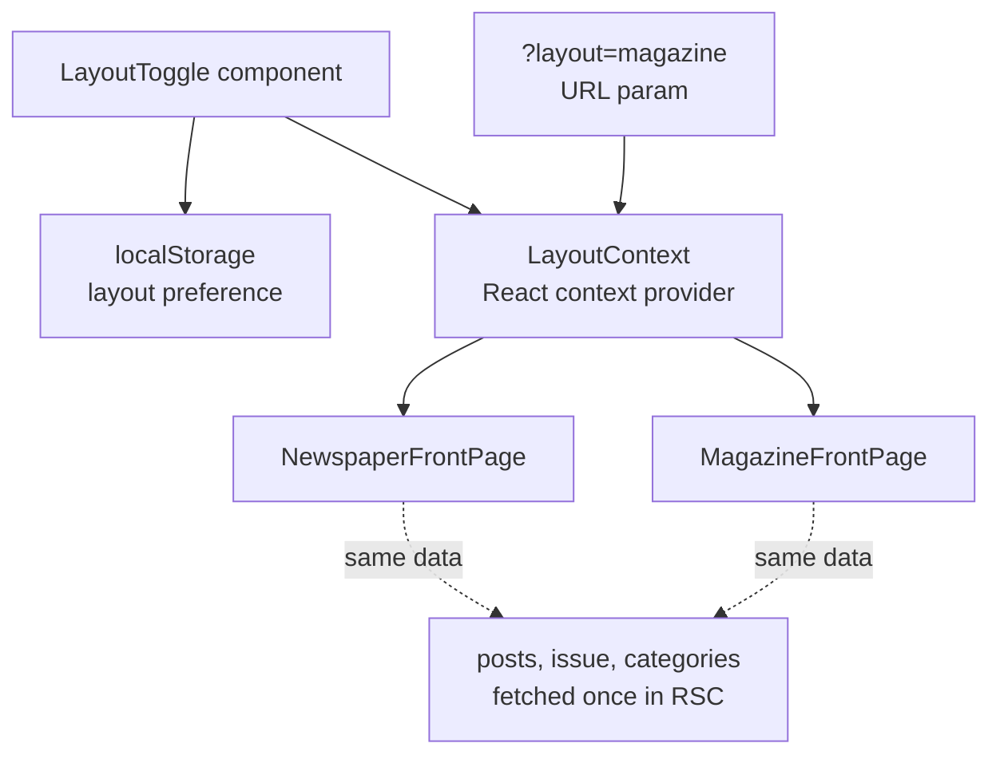

# Phase 3 — Magazine Layout + Toggle

**Status:** `[ ]` Not started
**Repo areas:** `frontend/newsletter/`
**Depends on:** Phase 2

## Goal

Add a second front page layout style (magazine) and a toggle so readers can switch between newspaper and magazine views. Preference persists across sessions.

---

## Architecture



## Technical Choices

| Concern | Choice | Rationale |
|---------|--------|-----------|
| State management | React Context (`LayoutContext`) + `localStorage` | Lightweight; no state library needed for a single preference |
| Persistence | `localStorage` primary; URL param override for sharing | No API call needed; anonymous readers don't need server persistence |
| Layout rendering | Conditional render at the `FrontPage` level; both components pre-imported | No lazy loading — both layouts are small; avoids flash |
| Transition | CSS `opacity` + `transform` transition (200ms) on layout swap | Smooth visual feedback without layout shift |
| Magazine typography | Google Fonts: Inter (headlines), DM Sans (body) | Modern sans-serif contrast to newspaper serif |
| Color system | Category-to-color map in `frontend/newsletter/src/lib/categoryColors.ts` | Each category gets a HSL accent for magazine category strips |

---

## Tasks

### 1. Layout Context — `frontend/newsletter/src/context/`

- [ ] **`LayoutContext.tsx`** (`'use client'`):

```typescript
type Layout = 'newspaper' | 'magazine';

interface LayoutContextValue {
  layout: Layout;
  setLayout: (layout: Layout) => void;
}

// Provider reads initial value from:
// 1. URL param ?layout= (highest priority)
// 2. localStorage 'layoutPreference'
// 3. Default: 'newspaper'
```

- [ ] **`LayoutProvider`** wraps the newsletter app in `layout.tsx`:

```typescript
// frontend/newsletter/src/app/layout.tsx
<LayoutProvider>
  {children}
</LayoutProvider>
```

---

### 2. Layout Toggle Component

- [ ] **`LayoutToggle.tsx`** (`'use client'`) — `frontend/newsletter/src/components/shared/LayoutToggle.tsx`:
  - Pill-shaped toggle with "Newspaper" and "Magazine" labels
  - Active side highlighted with CSS transition (sliding indicator)
  - On click: updates context, writes to `localStorage`, updates URL param (via `router.replace` without navigation)
  - Keyboard accessible: `role="radiogroup"`, arrow key navigation
  - Placed in `<Masthead>` for newspaper, in `<MagazineHeader>` for magazine

- [ ] **`LayoutToggle.module.scss`**:

```scss
.toggle {
  display: inline-flex;
  border: 1px solid var(--color-rule);
  border-radius: 999px;
  overflow: hidden;
  font-family: var(--font-body);
  font-size: 0.75rem;
  letter-spacing: 0.05em;
  text-transform: uppercase;
}

.option {
  padding: 0.375rem 0.75rem;
  cursor: pointer;
  transition: background 200ms, color 200ms;

  &.active {
    background: var(--color-ink);
    color: var(--color-bg);
  }
}
```

---

### 3. Magazine Layout Components — `frontend/newsletter/src/components/magazine/`

- [ ] **`MagazineHeader.tsx`**:
  - Clean sans-serif header bar: publication name (Inter, bold), date, layout toggle
  - No masthead decoration — minimal, modern

- [ ] **`MagazineFrontPageGrid.tsx`**:
  - CSS Grid: `grid-template-columns: 1fr 1fr` with hero spanning full width

  ```scss
  .magazineGrid {
    display: grid;
    grid-template-columns: 1fr 1fr;
    gap: var(--spacing-lg);
    max-width: 1200px;
    margin: 0 auto;
    padding: var(--spacing-lg);
  }

  .hero { grid-column: 1 / -1; }

  @media (max-width: 768px) {
    .magazineGrid { grid-template-columns: 1fr; }
  }
  ```

  - Renders: `<MagazineHero>` first (featured post), then `<MagazineCategoryStrip>` groups, then `<MagazineCard>` for remaining posts

- [ ] **`MagazineHero.tsx`**:
  - Full-bleed cover image with dark gradient overlay
  - Headline + excerpt + category badge overlaid in white text
  - Click → article page
  - Uses `next/image` with `fill` and `priority`

  ```scss
  .hero {
    position: relative;
    aspect-ratio: 21/9;
    border-radius: 12px;
    overflow: hidden;

    .overlay {
      position: absolute;
      inset: 0;
      background: linear-gradient(transparent 40%, rgba(0,0,0,0.8));
      display: flex;
      flex-direction: column;
      justify-content: flex-end;
      padding: var(--spacing-xl);
    }
  }
  ```

- [ ] **`MagazineCategoryStrip.tsx`**:
  - Horizontal band with category name on left, color accent border-left
  - Contains up to 4 `<MagazineCard>` items for that category
  - Color derived from `categoryColors.ts`:

  ```typescript
  // frontend/newsletter/src/lib/categoryColors.ts
  export const categoryColors: Record<string, string> = {
    writing:  'hsl(210, 60%, 50%)',
    projects: 'hsl(150, 50%, 40%)',
    reviews:  'hsl(30, 80%, 50%)',
    life:     'hsl(340, 60%, 50%)',
    tracking: 'hsl(270, 50%, 50%)',
    games:    'hsl(180, 60%, 40%)',
  };
  ```

- [ ] **`MagazineCard.tsx`**:
  - Card with image thumbnail (4:3), category badge (colored), headline, 2-line excerpt
  - Hover: subtle scale(1.02) + shadow
  - Bottom: reaction emojis + counts, comment count

  ```scss
  .card {
    border-radius: 8px;
    overflow: hidden;
    background: white;
    box-shadow: 0 1px 3px rgba(0,0,0,0.08);
    transition: transform 200ms, box-shadow 200ms;

    &:hover {
      transform: scale(1.02);
      box-shadow: 0 4px 12px rgba(0,0,0,0.12);
    }
  }
  ```

---

### 4. Shared Front Page Wrapper — `frontend/newsletter/src/app/page.tsx`

- [ ] Refactor homepage to use the layout context:

```typescript
// Server component fetches data
async function HomePage() {
  const issue = await getLatestIssue();
  const categories = await getCategories();
  return <FrontPage issue={issue} categories={categories} />;
}

// Client component selects layout
'use client';
function FrontPage({ issue, categories }) {
  const { layout } = useLayout();
  return layout === 'newspaper'
    ? <NewspaperFrontPage issue={issue} categories={categories} />
    : <MagazineFrontPage issue={issue} categories={categories} />;
}
```

Both layout components receive the same props — no duplicate API calls.

---

### 5. Magazine Styling

- [ ] **Magazine CSS custom properties** (applied when layout = magazine):

```scss
[data-layout="magazine"] {
  --font-headline: 'Inter', system-ui, sans-serif;
  --font-body: 'DM Sans', system-ui, sans-serif;
  --color-bg: #ffffff;
  --color-ink: #111111;
  --color-rule: #e5e5e5;
  --color-accent: #2563eb;  // blue accent
}
```

- [ ] Data attribute set on `<html>` via `LayoutProvider`:

```typescript
useEffect(() => {
  document.documentElement.dataset.layout = layout;
}, [layout]);
```

- [ ] Transition between layouts: `<main>` fades out (opacity 0, 100ms) → layout swaps → fades in (opacity 1, 100ms)

---

### 6. URL Param Support

- [ ] Shareable layout links: `?layout=magazine` or `?layout=newspaper`
- [ ] `LayoutProvider` reads from `useSearchParams()` on mount — overrides localStorage
- [ ] When shared, the recipient sees the intended layout but can toggle freely

---

## Decisions & Notes

<!-- Record decisions made during implementation here -->
