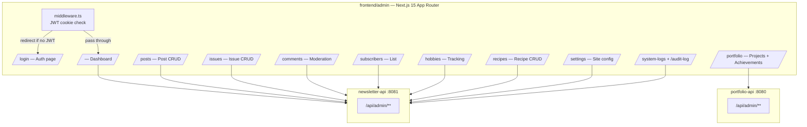

# Phase 4 — Unified Admin App (PWA)

**Status:** `[ ]` Not started
**Repo areas:** `frontend/admin/` (new), `backend/newsletter-api/`, `backend/portfolio-api/`
**Depends on:** Phase 1

## Goal

Build the standalone admin Next.js app that manages all content — newsletter posts, issues, portfolio projects, achievements, hobbies, recipes — from a single login. Mobile-optimized and installable as a PWA.

---

## Architecture



## Technical Choices

| Concern | Choice | Rationale |
|---------|--------|-----------|
| Framework | Next.js 15 App Router | Consistent with other frontend apps; RSC for dashboard |
| Auth | JWT in `httpOnly` cookie; Next.js middleware checks on every route | Cookie set by `newsletter-api /api/auth/login`; middleware reads and validates |
| UI component library | Shadcn/ui (Radix primitives + Tailwind) | Copy-paste components; fully customizable; excellent data table, form, dialog, toast |
| Styling | Tailwind CSS | Admin doesn't need newspaper aesthetics; Tailwind is fastest for dashboards |
| Rich text editor | TipTap (prosemirror-based) with Markdown serialization | Mature, extensible, supports images/embeds, outputs Markdown |
| Data tables | `@tanstack/react-table` (via Shadcn DataTable) | Sorting, filtering, pagination; used for posts, comments, subscribers |
| Forms | React Hook Form + Zod validation | Type-safe forms with schema validation |
| Drag and drop | `@hello-pangea/dnd` (maintained fork of react-beautiful-dnd) | Issue builder — reorder posts within an issue |
| Image upload | Direct S3 presigned URL upload; dropzone via `react-dropzone` | No server relay; fast multipart upload |
| Real-time polling | `useSWR` with `refreshInterval: 60000` | Dashboard live data, pending comment count, health checks |
| PWA | `next-pwa` (or `@serwist/next`) | Service worker, manifest, offline shell |
| Charting | `recharts` | Sparklines, subscriber growth, error rate charts |
| Port | `3002` (fixed in dev script) | Alongside portfolio (:3000) and newsletter (:3001) |

---

## Tasks

### 1. Project Scaffold

- [ ] Create `frontend/admin/` via `npx create-next-app@latest --ts --app --src-dir`
- [ ] Update root `package.json` workspaces — already includes `frontend/*`
- [ ] **`frontend/admin/package.json`**:

```json
{
  "name": "@evalieu/admin",
  "version": "0.1.0",
  "private": true,
  "scripts": {
    "dev": "next dev -p 3002",
    "build": "next build",
    "start": "next start",
    "lint": "next lint"
  },
  "dependencies": {
    "@evalieu/common": "*",
    "next": "15.3.2",
    "react": "^19.0.0",
    "react-dom": "^19.0.0",
    "swr": "^2",
    "@tiptap/react": "^2",
    "@tiptap/starter-kit": "^2",
    "@tiptap/extension-image": "^2",
    "@tiptap/extension-link": "^2",
    "@hello-pangea/dnd": "^17",
    "react-dropzone": "^14",
    "react-hook-form": "^7",
    "@hookform/resolvers": "^3",
    "zod": "^3",
    "recharts": "^2"
  }
}
```

- [ ] Install Shadcn/ui: `npx shadcn-ui@latest init` — configure Tailwind, add components as needed
- [ ] Install Tailwind CSS 4 and configure

---

### 2. Auth Implementation

- [ ] **`frontend/admin/src/middleware.ts`**:

```typescript
import { NextResponse } from 'next/server';
import type { NextRequest } from 'next/server';

export function middleware(request: NextRequest) {
  const token = request.cookies.get('access_token')?.value;
  const isLoginPage = request.nextUrl.pathname === '/login';

  if (!token && !isLoginPage) {
    return NextResponse.redirect(new URL('/login', request.url));
  }
  if (token && isLoginPage) {
    return NextResponse.redirect(new URL('/', request.url));
  }
  return NextResponse.next();
}

export const config = {
  matcher: ['/((?!_next/static|_next/image|favicon.ico).*)'],
};
```

- [ ] **`frontend/admin/src/lib/auth.ts`**:
  - `login(email, password)` — POST to `/api/auth/login`, cookie auto-set by browser
  - `refresh()` — POST to `/api/auth/refresh`
  - `logout()` — POST to `/api/auth/logout`, redirect to `/login`
  - `useAuth()` hook — SWR-based session check, returns `{ user, isLoading, error }`

- [ ] **`/login/page.tsx`** — email + password form, React Hook Form + Zod:

```typescript
const loginSchema = z.object({
  email: z.string().email(),
  password: z.string().min(8),
});
```

---

### 3. API Client — `frontend/admin/src/lib/api.ts`

```typescript
const NEWSLETTER_API = process.env.NEXT_PUBLIC_NEWSLETTER_API_URL || 'http://localhost:8081';
const PORTFOLIO_API = process.env.NEXT_PUBLIC_PORTFOLIO_API_URL || 'http://localhost:8080';

async function adminFetch<T>(base: string, path: string, options?: RequestInit): Promise<T> {
  const res = await fetch(`${base}${path}`, {
    ...options,
    credentials: 'include',    // send JWT cookie
    headers: {
      'Content-Type': 'application/json',
      ...options?.headers,
    },
  });
  if (res.status === 401) { window.location.href = '/login'; throw new Error('Unauthorized'); }
  if (!res.ok) throw new Error(`API ${res.status}: ${path}`);
  return res.json();
}

export const newsletterApi = {
  get: <T>(path: string) => adminFetch<T>(NEWSLETTER_API, path),
  post: <T>(path: string, body: unknown) => adminFetch<T>(NEWSLETTER_API, path, { method: 'POST', body: JSON.stringify(body) }),
  put: <T>(path: string, body: unknown) => adminFetch<T>(NEWSLETTER_API, path, { method: 'PUT', body: JSON.stringify(body) }),
  patch: <T>(path: string, body: unknown) => adminFetch<T>(NEWSLETTER_API, path, { method: 'PATCH', body: JSON.stringify(body) }),
  delete: <T>(path: string) => adminFetch<T>(NEWSLETTER_API, path, { method: 'DELETE' }),
};

export const portfolioApi = {
  get: <T>(path: string) => adminFetch<T>(PORTFOLIO_API, path),
  post: <T>(path: string, body: unknown) => adminFetch<T>(PORTFOLIO_API, path, { method: 'POST', body: JSON.stringify(body) }),
  put: <T>(path: string, body: unknown) => adminFetch<T>(PORTFOLIO_API, path, { method: 'PUT', body: JSON.stringify(body) }),
  delete: <T>(path: string) => adminFetch<T>(PORTFOLIO_API, path, { method: 'DELETE' }),
};
```

---

### 4. Admin Shell Layout

- [ ] **`frontend/admin/src/app/layout.tsx`** — `<AdminShell>` wrapping all pages:
  - Left sidebar (280px desktop, collapses to bottom tab bar on mobile < 768px)
  - Top bar with user avatar, logout button
  - Main content area with `max-width: 1400px`

- [ ] **Sidebar nav items** (each with icon from `lucide-react`):
  - Dashboard (`LayoutDashboard`)
  - Posts (`FileText`)
  - Issues (`Newspaper`)
  - Comments (`MessageSquare`) + pending count badge
  - Subscribers (`Users`)
  - Portfolio (`Briefcase`)
  - Hobbies & Tracking (`Target`)
  - Recipes (`ChefHat`)
  - Settings (`Settings`)
  - System Logs (`Activity`)

- [ ] **Pending comment count** — `useSWR('/api/admin/comments?status=pending&size=0', { refreshInterval: 60000 })` → extract `totalElements` → show as red badge

---

### 5. Post Management — `/posts`

- [ ] **Post list** (`/posts/page.tsx`):
  - `@tanstack/react-table` DataTable with columns: title (link), category, status (badge), format, published date, views, reactions, comments
  - Toolbar: search input, category filter dropdown, status filter dropdown
  - Pagination controls
  - "New Post" button → `/posts/new`

- [ ] **Post form** (`/posts/new/page.tsx` and `/posts/[id]/edit/page.tsx`):
  - React Hook Form with Zod schema:

  ```typescript
  const postSchema = z.object({
    title: z.string().min(1).max(500),
    excerpt: z.string().max(1000).optional(),
    body: z.string().min(1),
    categoryId: z.number(),
    subcategoryId: z.number().optional(),
    format: z.enum(['article', 'photo-caption', 'embedded-game', 'project-link', 'list', 'recipe', 'tracking-entry', 'quote']),
    layoutHint: z.enum(['featured', 'column', 'brief', 'sidebar', 'pull-quote']),
    issueId: z.number().optional(),
    tags: z.array(z.string()),
    status: z.enum(['draft', 'published']),
    quoteAuthor: z.string().optional(),
    quoteSource: z.string().optional(),
    gameUrl: z.string().url().optional(),
    gameType: z.enum(['iframe', 'canvas', 'link']).optional(),
  });
  ```

  - **TipTap editor** for body:
    - Extensions: StarterKit, Image (upload via presigned URL on paste/drop), Link, Placeholder
    - Live preview panel (rendered Markdown, split-screen)
    - Toolbar: bold, italic, headings, bullet/ordered list, blockquote, code, image, link

  - **Cover image upload**: `react-dropzone` → request presigned URL → upload to S3 → store objectUrl
  - **Gallery upload**: multi-image dropzone, same flow
  - **Conditional fields**: quote fields shown when format = `quote`; game fields when format = `embedded-game`
  - **Tag input**: comma-separated with chips; autocomplete from existing tags
  - **Save draft** (POST with status=draft) / **Publish** (POST with status=published) buttons

---

### 6. Issue Management — `/issues`

- [ ] Issue list DataTable: month/year, title, status, post count, "Send" button (Phase 7)
- [ ] New/edit issue form: title, month, year, layout preference, cover image, status
- [ ] **Issue builder** (`/issues/[id]/builder/page.tsx`):
  - Left panel: available posts (not assigned to any issue) as draggable cards
  - Right panel: issue post order as drop targets
  - Drag posts from available → issue, reorder within issue
  - Preview button opens newspaper/magazine front page preview in modal
  - Uses `@hello-pangea/dnd` for drag-and-drop

---

### 7. Portfolio Management — `/portfolio`

- [ ] **Project list** (`/portfolio/page.tsx`): DataTable — title, featured (toggle), achievement count, actions
- [ ] **Project form** (`/portfolio/new/page.tsx`, `/portfolio/[id]/edit/page.tsx`):
  - Fields: title, description, longDescription (TipTap), technologies (tag input), images (gallery upload), demoUrl, githubUrl, featured (checkbox)
  - Submits to portfolio-api: `POST /api/admin/projects`
- [ ] **Achievement timeline** (`/portfolio/[id]/achievements/page.tsx`):
  - Chronological list with date, title, context, photo
  - "Log Achievement" button → inline form or modal: title, date (default today), context (textarea), photo (dropzone)
  - Submits to portfolio-api: `POST /api/admin/projects/{id}/achievements`

---

### 8. Hobbies & Tracking — `/hobbies`

- [ ] **Hobby list** with tabs: Hobbies | Reading | Watching | (each fetches different endpoint)
- [ ] **Hobby detail** (`/hobbies/[id]/page.tsx`): progress timeline + "Add Entry" form
- [ ] **Reading list**: book title, author, status dropdown (want-to-read / reading / finished), rating (1-5 stars), notes
- [ ] **Watch list**: title, type (show/movie), status, rating, notes
- [ ] All items CRUD via newsletter-api admin endpoints

---

### 9. Settings — `/settings`

- [ ] Key-value settings form (fetches from `GET /api/admin/settings`, saves via `PUT /api/admin/settings`):
  - Site name, publication name
  - Ko-fi URL
  - Default layout preference (newspaper / magazine)
  - Admin email for alerts
  - Error alert threshold (errors/hour)

---

### 10. PWA Setup

- [ ] **`frontend/admin/public/manifest.json`**:

```json
{
  "name": "Eva's Admin",
  "short_name": "Admin",
  "start_url": "/",
  "display": "standalone",
  "background_color": "#ffffff",
  "theme_color": "#111111",
  "icons": [
    { "src": "/icon-192.png", "sizes": "192x192", "type": "image/png" },
    { "src": "/icon-512.png", "sizes": "512x512", "type": "image/png" }
  ]
}
```

- [ ] Configure `next-pwa` or `@serwist/next` in `next.config.ts`:
  - Precache app shell (layout, login page)
  - Runtime cache API responses (stale-while-revalidate)
  - Offline fallback page

- [ ] "Add to Home Screen" meta tags in `layout.tsx`:

```html
<link rel="manifest" href="/manifest.json" />
<meta name="apple-mobile-web-app-capable" content="yes" />
<meta name="apple-mobile-web-app-status-bar-style" content="black-translucent" />
```

---

## Decisions & Notes

<!-- Record decisions made during implementation here -->
