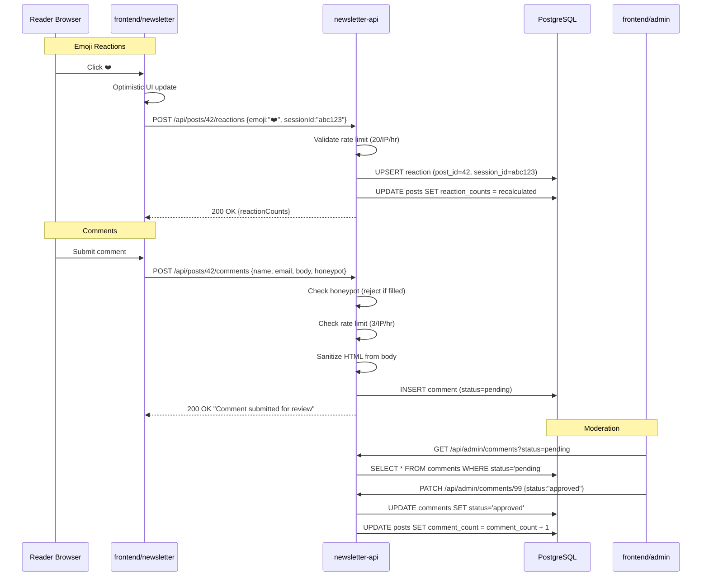

# Phase 6 — Engagement: Comments, Reactions & Sharing

**Status:** `[x]` Complete
**Repo areas:** `frontend/newsletter/`, `frontend/admin/`, `backend/newsletter-api/`
**Depends on:** Phase 2, Phase 4

## Goal

Let readers react to posts with emojis, submit comments (moderated), and share posts/issues. Engagement counts are visible on front page excerpt cards.

---

## Architecture



## Technical Choices

| Concern | Choice | Rationale |
|---------|--------|-----------|
| Session fingerprint | `FingerprintJS` open-source (browser-only, no server) → SHA-256 hash → stored in `sessionStorage` | Anonymous, no cookies, no PII; resistant to incognito but not bulletproof (acceptable for reactions) |
| Reaction UI | Optimistic update via local state → reconcile with API response | Instant feedback; if API fails, revert |
| Comment sanitization | `org.jsoup:jsoup` on the backend — `Jsoup.clean(body, Safelist.none())` strips all HTML | No HTML/Markdown in comments; plain text only |
| Sharing | Web Share API with fallback to copy-to-clipboard | Native share sheet on mobile; works everywhere with clipboard fallback |
| OG images | Static OG template rendered via `next/og` (Satori) | Dynamic OG images with post title + cover for social previews |

---

## Tasks

### 1. Emoji Reactions — Backend

Add to `backend/newsletter-api/build.gradle`: `implementation 'org.jsoup:jsoup:1.18.3'`

- [ ] **`ReactionService.java`**:

```java
@Transactional
public Post react(Long postId, String emoji, String sessionId) {
    // Validate emoji is in allowed set
    Set<String> allowed = Set.of("❤️", "🔥", "😂", "👏", "😮", "😢");
    if (!allowed.contains(emoji)) throw new IllegalArgumentException("Invalid emoji");

    // Upsert: if session already reacted, update emoji; else insert
    reactionRepository.findByPostIdAndSessionId(postId, sessionId)
        .ifPresentOrElse(
            existing -> existing.setEmoji(emoji),
            () -> reactionRepository.save(new Reaction(postId, emoji, sessionId))
        );

    // Recalculate denormalized counts
    return recalculateReactionCounts(postId);
}

private Post recalculateReactionCounts(Long postId) {
    List<Object[]> counts = reactionRepository.countByPostIdGroupByEmoji(postId);
    Map<String, Integer> reactionCounts = counts.stream()
        .collect(toMap(r -> (String) r[0], r -> ((Long) r[1]).intValue()));
    Post post = postRepository.findById(postId).orElseThrow();
    post.setReactionCounts(reactionCounts);
    return postRepository.save(post);
}
```

- [ ] **`ReactionController.java`**:
  - `POST /api/posts/{id}/reactions` — body: `{ emoji, sessionId }`; rate limited 20/IP/hr
  - `DELETE /api/posts/{id}/reactions` — header: `X-Session-Id`; removes reaction, recalculates counts

---

### 2. Emoji Reactions — Frontend

- [ ] **`frontend/newsletter/src/components/engagement/ReactionBar.tsx`** (`'use client'`):

```typescript
const EMOJIS = ['❤️', '🔥', '😂', '👏', '😮', '😢'] as const;

interface Props {
  postId: number;
  initialCounts: Record<string, number>;
}

export function ReactionBar({ postId, initialCounts }: Props) {
  const [counts, setCounts] = useState(initialCounts);
  const [selected, setSelected] = useState<string | null>(null);
  const sessionId = useSessionFingerprint();  // custom hook

  async function handleReact(emoji: string) {
    // Optimistic update
    setCounts(prev => ({ ...prev, [emoji]: (prev[emoji] || 0) + 1 }));
    setSelected(emoji);

    const res = await fetch(`/api/posts/${postId}/reactions`, {
      method: 'POST',
      headers: { 'Content-Type': 'application/json' },
      body: JSON.stringify({ emoji, sessionId }),
    });
    if (res.ok) {
      const data = await res.json();
      setCounts(data.reactionCounts);  // reconcile with server
    }
  }

  return (
    <div className={styles.reactionBar}>
      {EMOJIS.map(emoji => (
        <button
          key={emoji}
          onClick={() => handleReact(emoji)}
          className={cn(styles.emoji, selected === emoji && styles.selected)}
          aria-label={`React with ${emoji}`}
        >
          {emoji} <span>{counts[emoji] || 0}</span>
        </button>
      ))}
    </div>
  );
}
```

- [ ] **`useSessionFingerprint.ts`** hook:
  - On mount: check `sessionStorage` for existing fingerprint
  - If none: compute from `navigator.userAgent` + `screen.width` + `screen.height` + timezone → SHA-256 hash → store in `sessionStorage`
  - Returns the hash string

- [ ] **Front page excerpt cards** — add reaction summary: show top 2 emojis by count + total reactions number

---

### 3. Comments — Backend

- [ ] **`CommentService.java`**:

```java
@Transactional
public Comment submit(Long postId, CommentRequest req) {
    // Honeypot check (done in filter, but double-check)
    if (req.getHoneypot() != null && !req.getHoneypot().isBlank()) {
        return null;  // silent rejection
    }

    // Sanitize
    String cleanBody = Jsoup.clean(req.getBody(), Safelist.none());
    String cleanName = Jsoup.clean(req.getDisplayName(), Safelist.none());

    Comment comment = Comment.builder()
        .postId(postId)
        .authorName(cleanName.substring(0, Math.min(cleanName.length(), 100)))
        .authorEmail(req.getEmail())  // stored, never exposed
        .body(cleanBody.substring(0, Math.min(cleanBody.length(), 5000)))
        .status("pending")
        .build();
    return commentRepository.save(comment);
}

@Transactional
public Comment approve(Long commentId) {
    Comment c = commentRepository.findById(commentId).orElseThrow();
    c.setStatus("approved");
    commentRepository.save(c);
    postRepository.incrementCommentCount(c.getPostId());
    auditLogService.record("COMMENT_APPROVED", "comment", commentId, null);
    return c;
}
```

- [ ] **`CommentController.java`**:
  - `POST /api/posts/{id}/comments` — public; body: `{ displayName, email, body, honeypot }`; rate limited 3/IP/hr
  - `GET /api/posts/{id}/comments?page=0&size=50` — public; returns approved only; response omits `authorEmail`
  - `GET /api/admin/comments?status=pending&page=0&size=20` — admin; returns all statuses
  - `PATCH /api/admin/comments/{id}` — admin; body: `{ status: "approved" | "rejected" }`
  - `DELETE /api/admin/comments/{id}` — admin

---

### 4. Comments — Frontend (public)

- [ ] **`CommentForm.tsx`** (`'use client'`):
  - Fields: display name (required, max 100), message (required, max 5000)
  - Hidden honeypot field: `<input name="website" style={{ display: 'none' }} tabIndex={-1} />`
  - On submit: show loading spinner → POST → show success toast ("Your comment has been submitted for review") or error
  - React Hook Form + Zod validation

- [ ] **`CommentList.tsx`** (server component with client wrapper for pagination):
  - Renders approved comments: author name, date, body
  - No reply functionality (v1 is flat comments)
  - Paginated (50 per page, "Load more" button)

---

### 5. Comments — Frontend (admin)

- [ ] **Moderation queue** (`/comments/page.tsx` in `frontend/admin`):
  - DataTable: post title, author name, body preview (first 100 chars), submitted date, status
  - Filter: status dropdown (pending / approved / rejected)
  - Row actions: Approve (green), Reject (red), Delete (destructive)
  - Bulk select + bulk approve/reject
  - Pending count updates on action

---

### 6. Sharing — Frontend

- [ ] **`ShareBar.tsx`** (`'use client'`) — `frontend/newsletter/src/components/engagement/ShareBar.tsx`:

```typescript
interface Props {
  title: string;
  url: string;
}

export function ShareBar({ title, url }: Props) {
  const fullUrl = `${window.location.origin}${url}`;

  async function handleShare() {
    if (navigator.share) {
      await navigator.share({ title, url: fullUrl });
    } else {
      await navigator.clipboard.writeText(fullUrl);
      toast('Link copied!');
    }
  }

  return (
    <div className={styles.shareBar}>
      <button onClick={handleShare}>
        {navigator.share ? 'Share' : 'Copy Link'}
      </button>
    </div>
  );
}
```

- [ ] Placed on every article page (`/posts/[slug]`) and issue page (`/issues/[slug]`)
- [ ] "Share this issue" button on front page

---

### 7. Dynamic OG Images

- [ ] **`frontend/newsletter/src/app/posts/[slug]/opengraph-image.tsx`**:
  - Uses `next/og` (Satori + Resvg) to render dynamic OG image
  - Template: post title over cover image (or gradient), publication name, category badge
  - 1200x630 pixels

---

## Decisions & Notes

| Decision | Choice | Why |
|----------|--------|-----|
| FingerprintJS (open-source) for session identity | Browser-only fingerprint → SHA-256 | No cookies or PII stored; resistant to incognito; good enough for reaction deduplication on a personal site |
| Optimistic UI for reactions | Update local state → reconcile with API | Instant feedback; reactions feel responsive even on slow connections |
| Jsoup for comment sanitization | `Jsoup.clean(body, Safelist.none())` | Server-side HTML stripping prevents XSS; plain-text-only comments simplify rendering |
| Honeypot over CAPTCHA | Hidden form field | Better UX (no CAPTCHA friction); effective against simple bots; combined with rate limiting for defense-in-depth |
| Web Share API over social buttons | `navigator.share()` + clipboard fallback | Native OS share sheet on mobile; no third-party scripts; privacy-friendly |
| Flat comments (v1) | No reply threading | Simplifies moderation and rendering; threading can be added later if needed |

<!-- Record additional decisions during implementation here -->
