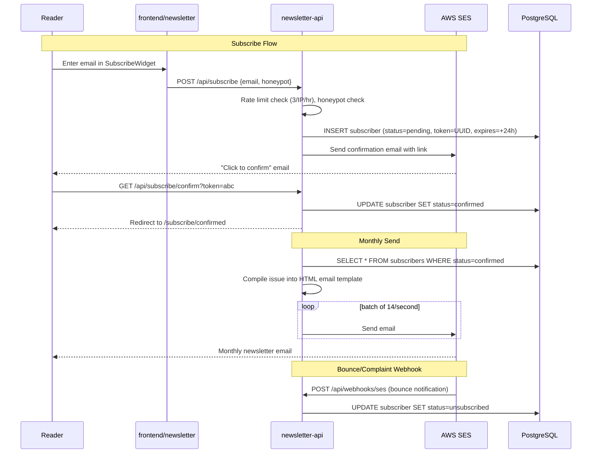

# Phase 7 — Newsletter Email & Subscriber Management

**Status:** `[ ]` Not started
**Repo areas:** `backend/newsletter-api/`, `frontend/newsletter/`, `frontend/admin/`
**Depends on:** Phase 1, Phase 4

## Goal

Readers can subscribe to the newsletter. Every month, publishing an issue triggers an email send to all confirmed subscribers with the front page digest. Subscriber list is fully manageable from the admin.

---

## Architecture



## Technical Choices

| Concern | Choice | Rationale |
|---------|--------|-----------|
| Email service | AWS SES v2 SDK (`software.amazon.awssdk:sesv2`) | Cost-effective ($0.10/1000 emails), deliverability, built-in bounce/complaint handling |
| Email template | Thymeleaf HTML template in `src/main/resources/templates/` | Spring Boot standard; type-safe variable binding; rendered server-side |
| Batch sending | `ScheduledExecutorService` with 14 emails/sec rate | SES sandbox limit is 14/s; production can request higher |
| Token generation | `UUID.randomUUID()` → stored as `confirmation_token` | Cryptographically strong enough for confirm/unsubscribe links |
| Email tracking | Tracking pixel (`1x1 transparent GIF`) + link wrapping | Industry standard for open/click rates; privacy-respectful (no third-party trackers) |
| Unsubscribe | RFC 8058 `List-Unsubscribe-Post` header + one-click link | Gmail and Apple Mail native unsubscribe support |

---

## Tasks

### 1. AWS SES Setup

- [ ] Add to `backend/newsletter-api/build.gradle`:

```gradle
implementation 'software.amazon.awssdk:sesv2:2.29.51'
```

- [ ] **SES configuration** — `application-prod.properties`:

```properties
aws.ses.region=us-east-1
aws.ses.from-email=newsletter@evalieu.com
aws.ses.from-name=The Eva Times
```

- [ ] **`config/SesConfig.java`**:

```java
@Bean
public SesV2Client sesClient() {
    return SesV2Client.builder()
        .region(Region.of(sesRegion))
        .credentialsProvider(DefaultCredentialsProvider.create())
        .build();
}
```

- [ ] **DNS records** (in your domain's DNS provider):
  - SPF: `v=spf1 include:amazonses.com ~all`
  - DKIM: 3 CNAME records (generated by SES domain verification)
  - DMARC: `v=DMARC1; p=quarantine; rua=mailto:dmarc@evalieu.com`

- [ ] Request SES production access (move out of sandbox)

---

### 2. Subscribe Flow — Backend

- [ ] **`SubscriberService.java`**:

```java
@Transactional
public void subscribe(String email, String source) {
    Optional<Subscriber> existing = subscriberRepository.findByEmail(email.toLowerCase());
    if (existing.isPresent()) {
        // Silent success — no enumeration
        return;
    }

    String token = UUID.randomUUID().toString();
    Subscriber sub = Subscriber.builder()
        .email(email.toLowerCase().trim())
        .status("pending")
        .source(source)
        .confirmationToken(token)
        .tokenExpiresAt(Instant.now().plus(24, ChronoUnit.HOURS))
        .build();
    subscriberRepository.save(sub);

    emailService.sendConfirmation(email, token);
    auditLogService.record("SUBSCRIBER_PENDING", "subscriber", sub.getId(), null);
}

@Transactional
public boolean confirm(String token) {
    Subscriber sub = subscriberRepository.findByConfirmationToken(token)
        .orElse(null);
    if (sub == null || sub.getTokenExpiresAt().isBefore(Instant.now())) {
        return false;
    }
    sub.setStatus("confirmed");
    sub.setConfirmedAt(Instant.now());
    sub.setConfirmationToken(null);   // single-use
    sub.setTokenExpiresAt(null);
    subscriberRepository.save(sub);
    auditLogService.record("SUBSCRIBER_CONFIRMED", "subscriber", sub.getId(), null);
    return true;
}

@Transactional
public void unsubscribe(String token) {
    // Token is the subscriber's email hashed, or a stored unsubscribe token
    Subscriber sub = subscriberRepository.findByUnsubscribeToken(token)
        .orElseThrow();
    sub.setStatus("unsubscribed");
    sub.setUnsubscribedAt(Instant.now());
    subscriberRepository.save(sub);
}
```

- [ ] **`V15__add_unsubscribe_token.sql`**:

```sql
ALTER TABLE subscribers ADD COLUMN unsubscribe_token VARCHAR(64);
-- Populate for existing subscribers
UPDATE subscribers SET unsubscribe_token = gen_random_uuid()::text WHERE unsubscribe_token IS NULL;
CREATE INDEX idx_subscribers_unsub_token ON subscribers(unsubscribe_token);
```

---

### 3. Email Service — `EmailService.java`

- [ ] **Confirmation email**:

```java
public void sendConfirmation(String email, String confirmToken) {
    String confirmUrl = siteUrl + "/api/subscribe/confirm?token=" + confirmToken;
    String html = thymeleaf.process("email/confirm-subscription", Map.of(
        "confirmUrl", confirmUrl,
        "publicationName", settingService.get("publication_name")
    ));

    sesClient.sendEmail(SendEmailRequest.builder()
        .fromEmailAddress(fromEmail)
        .destination(d -> d.toAddresses(email))
        .content(c -> c.simple(s -> s
            .subject(sub -> sub.data("Confirm your subscription to " + publicationName))
            .body(b -> b.html(h -> h.data(html)))
        ))
        .build());
}
```

- [ ] **Confirmation email template** — `src/main/resources/templates/email/confirm-subscription.html`:
  - Clean, minimal HTML email (inline CSS for email client compatibility)
  - "Confirm your subscription" CTA button
  - Text explaining what they're subscribing to

---

### 4. Monthly Email Send

- [ ] **`NewsletterSendService.java`**:

```java
@Transactional
public SendResult sendIssue(Long issueId) {
    Issue issue = issueRepository.findById(issueId).orElseThrow();
    List<Post> posts = postRepository.findByIssueIdAndStatus(issueId, "published");
    List<Subscriber> subscribers = subscriberRepository.findByStatus("confirmed");

    String html = thymeleaf.process("email/monthly-newsletter", Map.of(
        "issue", issue,
        "posts", posts,
        "publicationName", settingService.get("publication_name"),
        "siteUrl", siteUrl
    ));

    int sent = 0, failed = 0;
    for (Subscriber sub : subscribers) {
        String personalizedHtml = html
            .replace("{{unsubscribe_url}}", siteUrl + "/api/unsubscribe?token=" + sub.getUnsubscribeToken())
            .replace("{{tracking_pixel}}", siteUrl + "/api/track/open?sid=" + sub.getId() + "&iid=" + issueId);

        try {
            sesClient.sendEmail(SendEmailRequest.builder()
                .fromEmailAddress(fromEmail)
                .destination(d -> d.toAddresses(sub.getEmail()))
                .content(c -> c.simple(s -> s
                    .subject(sub2 -> sub2.data(issue.getTitle()))
                    .body(b -> b.html(h -> h.data(personalizedHtml)))
                ))
                .listManagementOptions(l -> l.contactListName("newsletter"))
                .headers(Header.builder()
                    .name("List-Unsubscribe")
                    .value("<" + siteUrl + "/api/unsubscribe?token=" + sub.getUnsubscribeToken() + ">")
                    .build(),
                  Header.builder()
                    .name("List-Unsubscribe-Post")
                    .value("List-Unsubscribe=One-Click")
                    .build()
                )
                .build());
            sent++;
            Thread.sleep(72);  // ~14 emails/sec to stay under SES limit
        } catch (Exception e) {
            failed++;
            log.error("Failed to send to {}: {}", sub.getEmail(), e.getMessage());
        }
    }

    auditLogService.record("ISSUE_SENT", "issue", issueId,
        Map.of("sent", sent, "failed", failed, "total", subscribers.size()));
    return new SendResult(sent, failed, subscribers.size());
}
```

- [ ] **Monthly newsletter template** — `src/main/resources/templates/email/monthly-newsletter.html`:
  - Inline CSS (email-safe; no external stylesheets)
  - Max-width 600px container
  - Masthead: publication name, issue month/year
  - Sections grouped by category, each with headline + excerpt + "Read more →" link
  - Footer: unsubscribe link, "Powered by The Eva Times"
  - 1x1 tracking pixel `` at bottom

---

### 5. Email Tracking

- [ ] **`TrackingController.java`**:

```java
@GetMapping("/api/track/open")
public ResponseEntity<byte[]> trackOpen(
    @RequestParam Long sid,   // subscriber ID
    @RequestParam Long iid    // issue ID
) {
    trackingService.recordOpen(sid, iid);
    byte[] pixel = Base64.getDecoder().decode(TRANSPARENT_1X1_GIF);
    return ResponseEntity.ok()
        .contentType(MediaType.IMAGE_GIF)
        .cacheControl(CacheControl.noStore())
        .body(pixel);
}

@GetMapping("/api/track/click")
public ResponseEntity<Void> trackClick(
    @RequestParam Long sid,
    @RequestParam Long iid,
    @RequestParam String url
) {
    trackingService.recordClick(sid, iid, url);
    return ResponseEntity.status(302)
        .header("Location", url)
        .build();
}
```

- [ ] **`V16__create_email_tracking.sql`**:

```sql
CREATE TABLE email_events (
    id              BIGSERIAL PRIMARY KEY,
    subscriber_id   BIGINT NOT NULL REFERENCES subscribers(id),
    issue_id        BIGINT NOT NULL REFERENCES issues(id),
    event_type      VARCHAR(10) NOT NULL,  -- open | click
    url             TEXT,                  -- for click events
    created_at      TIMESTAMP NOT NULL DEFAULT NOW()
);

CREATE TABLE issue_send_stats (
    id              BIGSERIAL PRIMARY KEY,
    issue_id        BIGINT NOT NULL REFERENCES issues(id),
    total_sent      INT NOT NULL DEFAULT 0,
    total_bounced   INT NOT NULL DEFAULT 0,
    total_complained INT NOT NULL DEFAULT 0,
    sent_at         TIMESTAMP NOT NULL DEFAULT NOW()
);
```

---

### 6. SES Bounce/Complaint Webhook

- [ ] **`SesWebhookController.java`**:

```java
@PostMapping("/api/webhooks/ses")
public ResponseEntity<Void> handleSesNotification(@RequestBody String body) {
    // Parse SNS notification → SES bounce/complaint
    JsonNode node = objectMapper.readTree(body);
    String type = node.get("notificationType").asText();

    if ("Bounce".equals(type)) {
        JsonNode bounce = node.get("bounce");
        for (JsonNode recipient : bounce.get("bouncedRecipients")) {
            String email = recipient.get("emailAddress").asText();
            subscriberService.autoUnsubscribe(email, "bounce");
        }
    } else if ("Complaint".equals(type)) {
        JsonNode complaint = node.get("complaint");
        for (JsonNode recipient : complaint.get("complainedRecipients")) {
            String email = recipient.get("emailAddress").asText();
            subscriberService.autoUnsubscribe(email, "complaint");
        }
    }

    return ResponseEntity.ok().build();
}
```

- [ ] SES → SNS Topic → HTTPS endpoint (`/api/webhooks/ses`) — configure in AWS console

---

### 7. Subscribe Widget — Frontend

- [ ] **`SubscribeWidget.tsx`** (`'use client'`) — `frontend/newsletter/src/components/shared/SubscribeWidget.tsx`:

```typescript
export function SubscribeWidget({ source }: { source: string }) {
  const [email, setEmail] = useState('');
  const [status, setStatus] = useState<'idle' | 'loading' | 'success' | 'error'>('idle');

  async function handleSubmit(e: FormEvent) {
    e.preventDefault();
    setStatus('loading');
    const res = await fetch('/api/subscribe', {
      method: 'POST',
      headers: { 'Content-Type': 'application/json' },
      body: JSON.stringify({ email, source, honeypot: '' }),
    });
    setStatus(res.ok ? 'success' : 'error');
  }

  if (status === 'success') return <p>Check your email to confirm!</p>;

  return (
    <form onSubmit={handleSubmit}>
      <input type="email" value={email} onChange={e => setEmail(e.target.value)} required />
      <input name="website" style={{ display: 'none' }} tabIndex={-1} />
      <button disabled={status === 'loading'}>Subscribe</button>
    </form>
  );
}
```

- [ ] Embedded on: newsletter front page sidebar, article page footer, portfolio site footer

---

### 8. Admin — Subscriber Management

- [ ] **`/subscribers/page.tsx`** in `frontend/admin`:
  - DataTable: email, display name, status (badge), confirmed date, source, actions
  - Search bar, filter by status
  - Export CSV button — triggers download of all confirmed subscribers
  - Manually add subscriber (bypasses double opt-in)
  - Manually unsubscribe / delete

- [ ] **Issue send stats** — shown on `/issues/[id]` page:
  - Total sent, bounced, complained
  - Open rate: unique opens / total sent
  - Click rate: unique clicks / total sent
  - Powered by `email_events` and `issue_send_stats` tables

---

## Decisions & Notes

| Decision | Choice | Why |
|----------|--------|-----|
| AWS SES over Mailgun/SendGrid | SES v2 | Already in AWS ecosystem; $0.10/1000 emails; no additional vendor; built-in bounce/complaint handling via SNS |
| Thymeleaf over MJML | Thymeleaf templates | Spring Boot native; no build step; type-safe variable binding; simpler for a single email template |
| Double opt-in | Confirmation email required | Industry best practice; reduces spam complaints; ensures valid email addresses |
| RFC 8058 List-Unsubscribe-Post | One-click unsubscribe header | Gmail and Apple Mail show native unsubscribe button; reduces complaints; regulatory compliance |
| Tracking pixel for opens | 1x1 transparent GIF | Industry standard; privacy-respectful (self-hosted, no third-party trackers); simple to implement |
| Silent success on duplicate subscribe | No error for existing email | Prevents email enumeration attacks; existing subscribers see no difference |

<!-- Record additional decisions during implementation here -->
